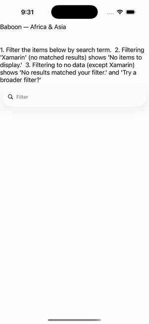

# CollectionView — Empty View Selector

Ports .NET MAUI's `EmptyViewWithDataTemplateSelector` ([oracle](../../../../../src/Controls/samples/Controls.Sample/Pages/Controls/CollectionViewGalleries/EmptyViewGalleries/EmptyViewWithDataTemplateSelector.xaml)) as a code-first `maui::samples::empty_view_selector_page`. An EmptyViewTemplate chosen by a data_template_selector keyed on the search term ('xamarin' → 'No items to display.', else 'No results matched your filter…'), with a Name-matching filter + clear/fill toggle.

| macOS (AppKit) | iOS (UIKit) |
| --- | --- |
|  |  |

**Running on iOS:**

**Platforms:** macOS ✅ demo · iOS ✅ demo · Windows ⬜ TODO · Linux ⬜ TODO · Android ⬜ TODO

**Run it:** `MAUI_SAMPLE_PAGE=empty_view_selector ./examples/build/gallery/gallery` (macOS) · `SIMCTL_CHILD_MAUI_SAMPLE_PAGE=empty_view_selector xcrun simctl launch booted dev.maui-cpp.ios-gallery` (iOS)

> Struct-typed item cells render their template-bound content natively (post the TemplatedCell.Bind fix).
