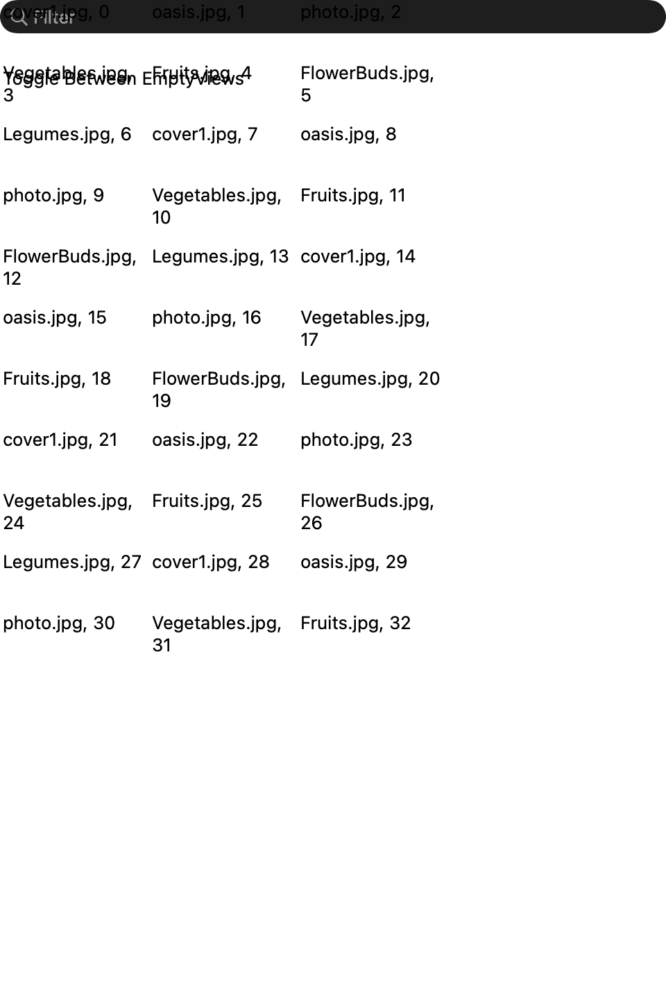
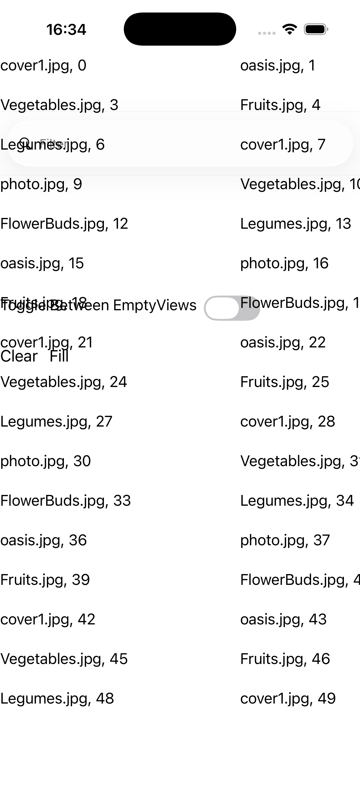
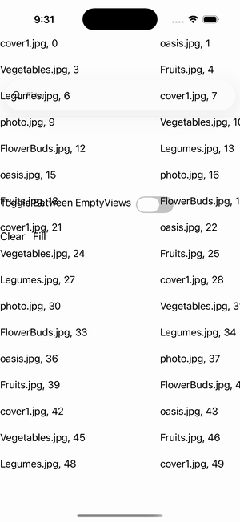

# CollectionView — Empty View Swap

Ports .NET MAUI's `EmptyViewSwapGallery` ([oracle](../../../../../src/Controls/samples/Controls.Sample/Pages/Controls/CollectionViewGalleries/EmptyViewGalleries/EmptyViewSwapGallery.xaml)) as a code-first `maui::samples::empty_view_swap_page`. A 3-span GridItemsLayout CollectionView over 50 caption rows; a SearchBar drives in-place filtering and a Switch swaps the EmptyView between two owned ContentView alternatives, with Clear/Fill emptying/restoring the source so the active EmptyView shows.

| macOS (AppKit) | iOS (UIKit) |
| --- | --- |
|  |  |

**Running on iOS:**

**Platforms:** macOS ✅ demo · iOS ✅ demo · Windows ⬜ TODO · Linux ⬜ TODO · Android ⬜ TODO

**Run it:** `MAUI_SAMPLE_PAGE=empty_view_swap ./examples/build/gallery/gallery` (macOS) · `SIMCTL_CHILD_MAUI_SAMPLE_PAGE=empty_view_swap xcrun simctl launch booted dev.maui-cpp.ios-gallery` (iOS)

> Struct-typed item cells render their template-bound content natively (post the TemplatedCell.Bind fix).
