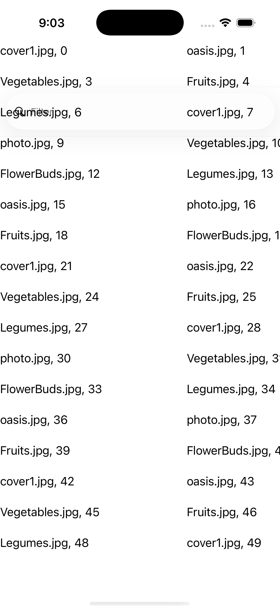
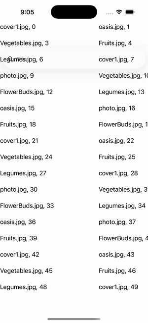

# CollectionView — Empty View Template

Ports .NET MAUI's `EmptyViewTemplateGallery` ([oracle](../../../../../src/Controls/samples/Controls.Sample/Pages/Controls/CollectionViewGalleries/EmptyViewGalleries/EmptyViewTemplateGallery.xaml)) as a code-first `maui::samples::empty_view_template_page`. An **EmptyViewTemplate** (a templated, data-bound view — 'Your filter term of {term} did not match any records') shown on the empty state; a SearchBar filters a 50-row source and publishes the term, with an explicit clear/fill toggle.

| macOS (AppKit) | iOS (UIKit) |
| --- | --- |
|  |  |

**Running on iOS:**

**Platforms:** macOS ✅ demo · iOS ✅ demo · Windows ⬜ TODO · Linux ⬜ TODO · Android ⬜ TODO

**Run it:** `MAUI_SAMPLE_PAGE=empty_view_template ./examples/build/gallery/gallery` (macOS) · `SIMCTL_CHILD_MAUI_SAMPLE_PAGE=empty_view_template xcrun simctl launch booted dev.maui-cpp.ios-gallery` (iOS)

> Struct-typed item cells render their template-bound content natively (post the TemplatedCell.Bind fix).
