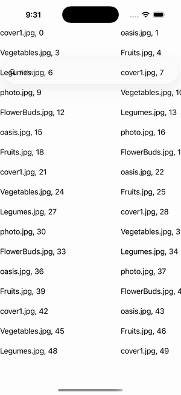

# CollectionView — Empty View (View)

Ports .NET MAUI's `EmptyViewViewGallery` ([oracle](../../../../../src/Controls/samples/Controls.Sample/Pages/Controls/CollectionViewGalleries/EmptyViewGalleries/EmptyViewViewGallery.xaml)) as a code-first `maui::samples::empty_view_view_page`. A CollectionView whose EmptyView is a **View** (a stack of two labels: 'No results matched your filter.' + 'Maybe try a broader filter?'), hosted via the handler's `as_bindable()` branch; SearchBar filter + clear/fill toggle.

| macOS (AppKit) | iOS (UIKit) |
| --- | --- |
|  |  |

**Running on iOS:**

**Platforms:** macOS ✅ demo · iOS ✅ demo · Windows ⬜ TODO · Linux ⬜ TODO · Android ⬜ TODO

**Run it:** `MAUI_SAMPLE_PAGE=empty_view_view ./examples/build/gallery/gallery` (macOS) · `SIMCTL_CHILD_MAUI_SAMPLE_PAGE=empty_view_view xcrun simctl launch booted dev.maui-cpp.ios-gallery` (iOS)

> Struct-typed item cells render their template-bound content natively (post the TemplatedCell.Bind fix).
