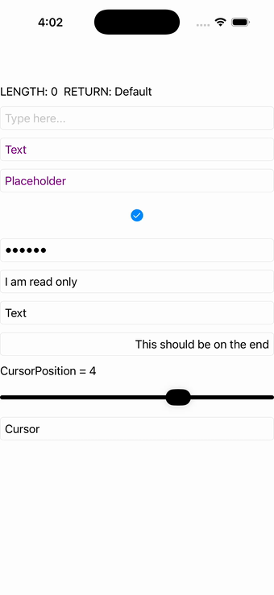

# Entry

Ports .NET MAUI's `EntryPage` ([oracle](../../../../../src/Controls/samples/Controls.Sample/Pages/Controls/EntryPage.xaml)) as a code-first `maui::samples::entry_page`. A live entry whose text drives a length/return readout and steps the ReturnType enum; an IsPassword toggle on a numeric-keyboard password entry; a slider driving CursorPosition; plus TextColor, Placeholder/PlaceholderColor, IsReadOnly, ClearButtonVisibility and HorizontalTextAlignment rows.

| macOS (AppKit) | iOS (UIKit) |
| --- | --- |
|  |  |

**Running on iOS:**

**Platforms:** macOS ✅ demo · iOS ✅ demo · Windows ⬜ TODO · Linux ⬜ TODO · Android ⬜ TODO

**Run it:**
- macOS — `MAUI_SAMPLE_PAGE=entry ./build/apple/maui_macos_gallery`
- iOS sim — `SIMCTL_CHILD_MAUI_SAMPLE_PAGE=entry xcrun simctl launch booted dev.maui-cpp.ios-gallery`

> Notes: BackgroundColor / background-brush / VisualState / Focus-Unfocus alerts are out of scope (no headless seam).
