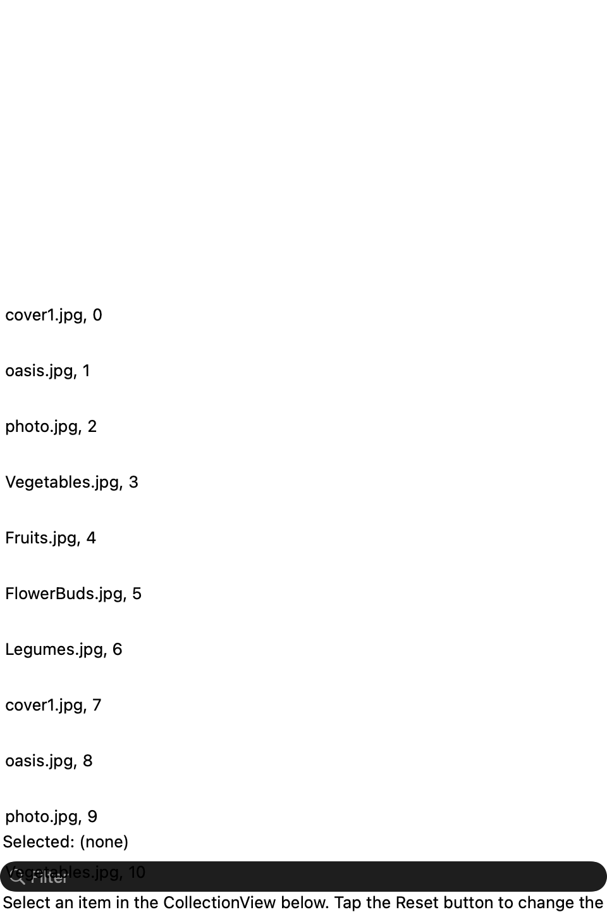
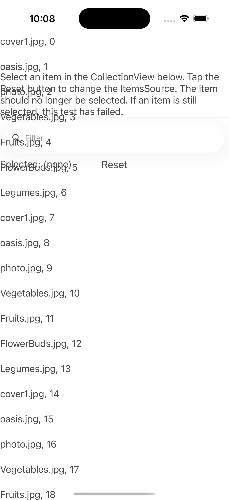
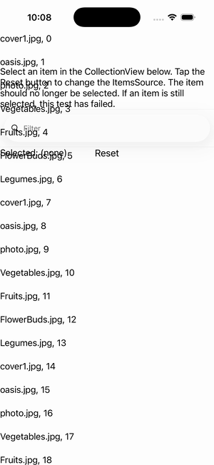

# CollectionView — Filter + Selection

Ports .NET MAUI's `FilterSelection` ([oracle](../../../../../src/Controls/samples/Controls.Sample/Pages/Controls/CollectionViewGalleries/SelectionGalleries/FilterSelection.xaml)) as a code-first `maui::samples::filter_selection_page`. SelectionMode=Single over a live source; SearchBar filters in place (the verbatim FilterItems projection), and a Reset button **replaces** the whole ItemsSource with a fresh source — clearing the prior single selection (the 'selection must not survive a source swap' invariant), surfaced via a readout.

| macOS (AppKit) | iOS (UIKit) |
| --- | --- |
|  |  |

**Running on iOS:**

**Platforms:** macOS ✅ demo · iOS ✅ demo · Windows ⬜ TODO · Linux ⬜ TODO · Android ⬜ TODO

**Run it:** `MAUI_SAMPLE_PAGE=filter_selection ./build/apple/maui_macos_gallery` (macOS) · `SIMCTL_CHILD_MAUI_SAMPLE_PAGE=filter_selection xcrun simctl launch booted dev.maui-cpp.ios-gallery` (iOS)
