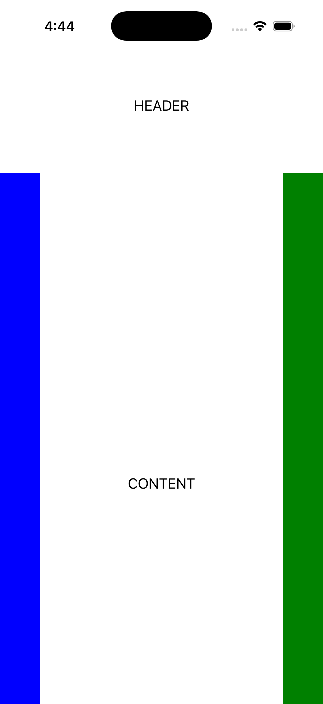
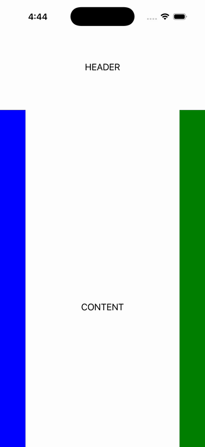

# FlexLayout

Ports .NET MAUI's `FlexLayoutPage` ([oracle](../../../../../src/Controls/samples/Controls.Sample/Pages/Layouts/FlexLayoutPage.xaml)) as a code-first `maui::samples::flex_layout_page`. Nested flexboxes ("holy grail"): an outer Column flex (header/body/footer with body Grow=1) and an inner Row flex (content Grow=1, nav BoxView Basis=50 + Order=-1, aside Basis=50).

| macOS (AppKit) | iOS (UIKit) |
| --- | --- |
|  |  |

**Running on iOS:**

**Platforms:** macOS ✅ demo · iOS ✅ demo · Windows ⬜ TODO · Linux ⬜ TODO · Android ⬜ TODO

**Run it:**
- macOS — `MAUI_SAMPLE_PAGE=flex_layout ./build/apple/maui_macos_gallery`
- iOS sim — `SIMCTL_CHILD_MAUI_SAMPLE_PAGE=flex_layout xcrun simctl launch booted dev.maui-cpp.ios-gallery`

> On macOS the gallery host sizes the window to the measured content over plain (unflipped) NSViews, so
> layout pages can show a partial/single block — the iOS capture is the faithful top-down layout. Notes: named FontSize=Large stands in as 18pt.
