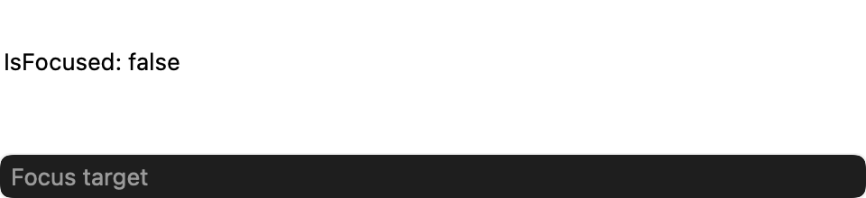
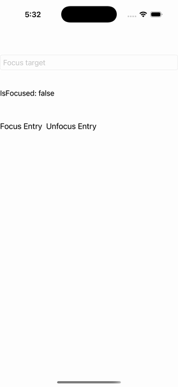

# Focus

Ports .NET MAUI's `FocusPage` ([oracle](../../../../../src/Controls/samples/Controls.Sample/Pages/Core/FocusPage.xaml)) as a code-first `maui::samples::focus_page`. The focus subsystem — Focus()/Unfocus()/IsFocused, fully observable headless.

| macOS (AppKit) | iOS (UIKit) |
| --- | --- |
|  |  |

**Running on iOS:**

**Platforms:** macOS ✅ demo · iOS ✅ demo · Windows ⬜ TODO · Linux ⬜ TODO · Android ⬜ TODO

**Run it:** `MAUI_SAMPLE_PAGE=focus ./build/apple/maui_macos_gallery` (macOS) · `SIMCTL_CHILD_MAUI_SAMPLE_PAGE=focus xcrun simctl launch booted dev.maui-cpp.ios-gallery` (iOS)

> Focus/Unfocus buttons call `entry.focus()`/`entry.unfocus()`; the entry's focused/unfocused events append "Focused"/"Unfocused" lines to a scrolling log and refresh an `IsFocused: true/false` readout via `entry.is_focused()`. The handler must be attached for `focus()` to realize (handled by attach_handlers' bottom-up order); the XAML Grid is replaced by a vertical stack (placement-only, behavior is layout-independent).
