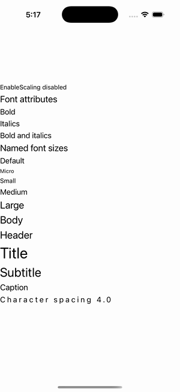

# Fonts

Ports .NET MAUI's `FontsPage` ([oracle](../../../../../src/Controls/samples/Controls.Sample/Pages/UserInterface/FontsPage.xaml)) as a code-first `maui::samples::fonts_page`. FontAttributes, named font sizes, auto-scaling, and character spacing on labels.

| macOS (AppKit) | iOS (UIKit) |
| --- | --- |
|  |  |

**Running on iOS:**

**Platforms:** macOS ✅ demo · iOS ✅ demo · Windows ⬜ TODO · Linux ⬜ TODO · Android ⬜ TODO

**Run it:** `MAUI_SAMPLE_PAGE=fonts ./examples/build/gallery/gallery` (macOS) · `SIMCTL_CHILD_MAUI_SAMPLE_PAGE=fonts xcrun simctl launch booted dev.maui-cpp.ios-gallery` (iOS)

> Bold / Italic / Bold+Italic (folded into `font_weight` + `font_slant`), `FontAutoScalingEnabled=false` via `font.with_auto_scaling(false)`, the named sizes Default/Micro/Small/Medium/Large/Body/Header/Title/Subtitle/Caption resolving the exact Apple `FontNamedSizeService` values (17/12/14/17/22/23/23/34/28/18), plus a character-spacing (kerning) label. Custom font *families* need bundled font assets (deferred); the attributes/sizes/spacing all render natively.
