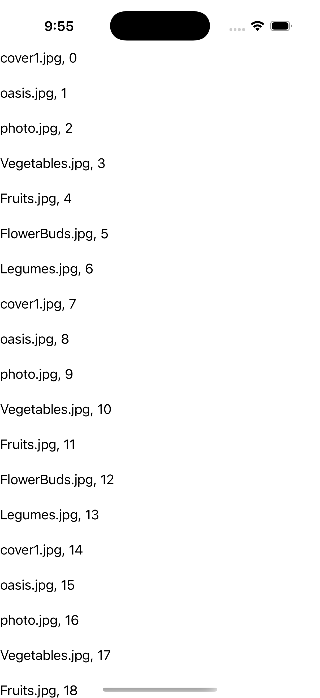
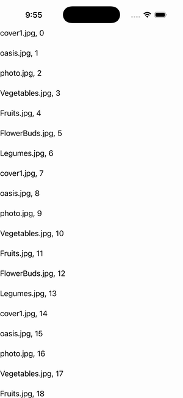

# CollectionView — Footer Only

Ports .NET MAUI's `FooterOnlyString` ([oracle](../../../../../src/Controls/samples/Controls.Sample/Pages/Controls/CollectionViewGalleries/HeaderFooterGalleries/FooterOnlyString.xaml)) as a code-first `maui::samples::footer_only_string_page`. A CollectionView with a plain-string Footer and **no** Header (the footer-only supplemental path), over a live caption-bound source.

| macOS (AppKit) | iOS (UIKit) |
| --- | --- |
|  |  |

**Running on iOS:**

**Platforms:** macOS ✅ demo · iOS ✅ demo · Windows ⬜ TODO · Linux ⬜ TODO · Android ⬜ TODO

**Run it:** `MAUI_SAMPLE_PAGE=footer_only_string ./build/apple/maui_macos_gallery` (macOS) · `SIMCTL_CHILD_MAUI_SAMPLE_PAGE=footer_only_string xcrun simctl launch booted dev.maui-cpp.ios-gallery` (iOS)
