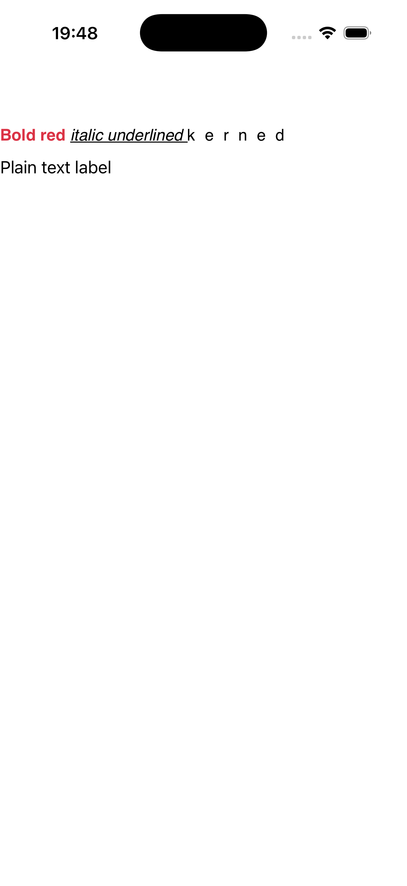

# Formatted text

A `label` whose `FormattedText` is built from several styled spans — bold, italic, coloured, underlined
and kerned runs — plus a plain label proving the `Text` ⇄ `FormattedText` exclusivity. Source:
[`formatted_text_page.hpp`](../../../examples/gallery/pages/formatted_text_page.hpp).

| macOS (AppKit) | iOS (UIKit) |
| --- | --- |
|  |  |

**Running on iOS:**

**Native rendering exercised:** `NSAttributedString`/`NSAttributedString` (UIKit) attributed-run
composition — per-span font weight, italic, foreground colour, underline and character spacing.

**Platforms:** macOS ✅ demo · iOS ✅ demo · Windows ⬜ TODO · Linux ⬜ TODO · Android ⬜ TODO

**Run it:**
- macOS — `MAUI_SAMPLE_PAGE=formatted_text ./examples/build/gallery/gallery`
- iOS sim — `SIMCTL_CHILD_MAUI_SAMPLE_PAGE=formatted_text xcrun simctl launch booted dev.maui-cpp.ios-gallery`

> The iOS capture clearly shows the **bold-red**, *italic-underlined* and k e r n e d runs in a single
> label, with a plain label below.
