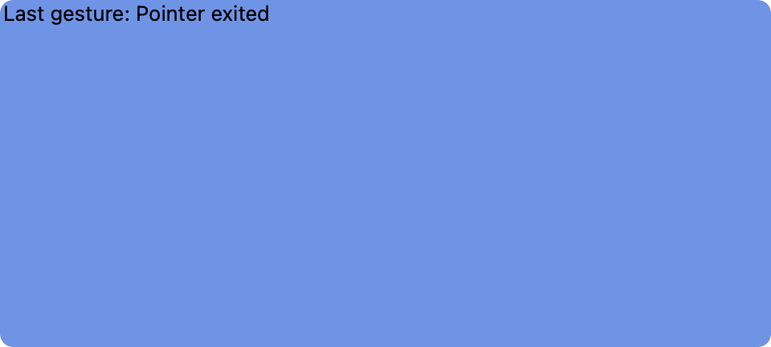
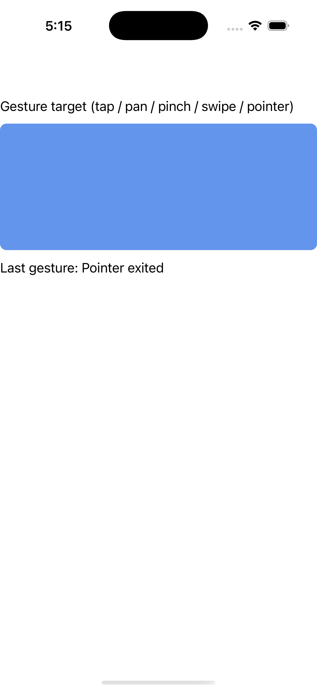
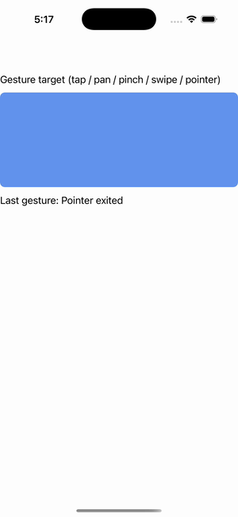

# Gestures

Ports .NET MAUI's `GesturesPage` ([oracle](../../../../../src/Controls/samples/Controls.Sample/Pages/Core/GesturesPage.xaml)) as a code-first `maui::samples::gestures_page`. The full gesture-recognizer family attached to one target view, each wired to a readout label.

| macOS (AppKit) | iOS (UIKit) |
| --- | --- |
|  |  |

**Running on iOS:**

**Platforms:** macOS ✅ demo · iOS ✅ demo · Windows ⬜ TODO · Linux ⬜ TODO · Android ⬜ TODO

**Run it:** `MAUI_SAMPLE_PAGE=gestures ./examples/build/gallery/gallery` (macOS) · `SIMCTL_CHILD_MAUI_SAMPLE_PAGE=gestures xcrun simctl launch booted dev.maui-cpp.ios-gallery` (iOS)

> Tap, Pan (state machine), Pinch (relative scale), Swipe (all directions + threshold), Pointer (entered/moved/pressed/released/exited) added via `gesture_recognizers().add`. Headless has no native input, so `attach_handlers()` issues one deterministic synthetic drive per recognizer through each `Send*`/`i_*_gesture_controller` seam (the same path the gesture unit tests use) so the static capture shows the readout reacting; one recognizer honors `View.ValidateGesture`'s single-pinch rule. The real GesturesPage.xaml is a Shell-nav CollectionView (no headless analog) — this builds the recognizer demo those sections lead to.
