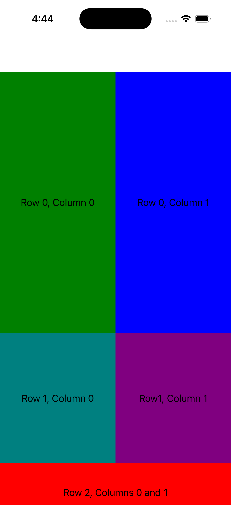
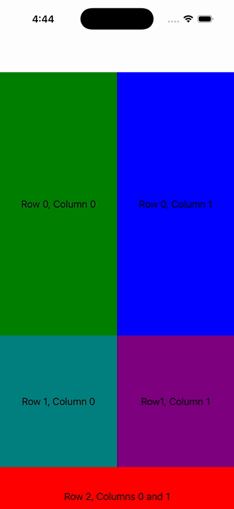

# Grid

Ports .NET MAUI's `GridPage` ([oracle](../../../../../src/Controls/samples/Controls.Sample/Pages/Layouts/GridPage.xaml)) as a code-first `maui::samples::grid_page`. A 3-row (2*/*/100) × 2-col (*/*) Grid with a colored BoxView + centered Label per cell and a bottom row spanning both columns (Grid.Row/Column + ColumnSpan).

| macOS (AppKit) | iOS (UIKit) |
| --- | --- |
|  |  |

**Running on iOS:**

**Platforms:** macOS ✅ demo · iOS ✅ demo · Windows ⬜ TODO · Linux ⬜ TODO · Android ⬜ TODO

**Run it:**
- macOS — `MAUI_SAMPLE_PAGE=grid ./build/apple/maui_macos_gallery`
- iOS sim — `SIMCTL_CHILD_MAUI_SAMPLE_PAGE=grid xcrun simctl launch booted dev.maui-cpp.ios-gallery`

> On macOS the gallery host sizes the window to the measured content over plain (unflipped) NSViews, so
> layout pages can show a partial/single block — the iOS capture is the faithful top-down layout. Notes: layout-option centering maps to text alignment.
