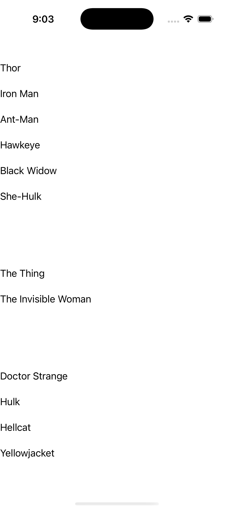
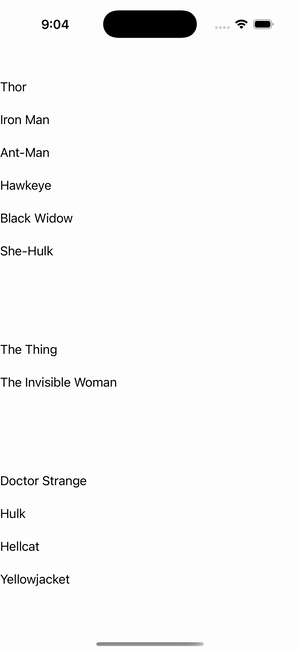

# CollectionView — Grid Grouping

Ports .NET MAUI's `GridGrouping` ([oracle](../../../../../src/Controls/samples/Controls.Sample/Pages/Controls/CollectionViewGalleries/GroupingGalleries/GridGrouping.xaml)) as a code-first `maui::samples::grid_grouping_page`. A grouped CollectionView (IsGrouped) over a GridItemsLayout(Span 2) with LightGreen group-header / Orange group-footer ('Total members: N') templates and Member-name cells, over the full six-team SuperTeams roster + view-level Header/Footer.

| macOS (AppKit) | iOS (UIKit) |
| --- | --- |
|  |  |

**Running on iOS:**

**Platforms:** macOS ✅ demo · iOS ✅ demo · Windows ⬜ TODO · Linux ⬜ TODO · Android ⬜ TODO

**Run it:** `MAUI_SAMPLE_PAGE=grid_grouping ./build/apple/maui_macos_gallery` (macOS) · `SIMCTL_CHILD_MAUI_SAMPLE_PAGE=grid_grouping xcrun simctl launch booted dev.maui-cpp.ios-gallery` (iOS)

> Struct-typed item cells render their template-bound content natively (post the TemplatedCell.Bind fix).
