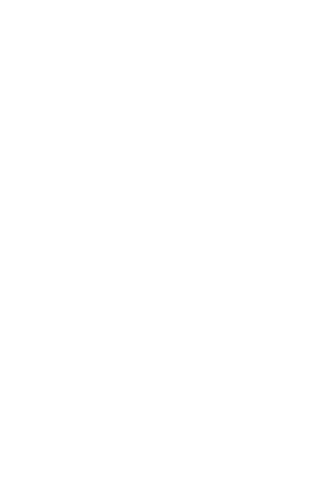
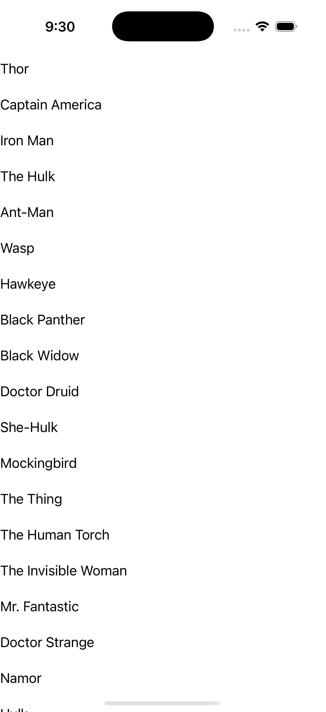

# CollectionView — Grouping (no templates)

Ports .NET MAUI's `GroupingNoTemplates` ([oracle](../../../../../src/Controls/samples/Controls.Sample/Pages/Controls/CollectionViewGalleries/GroupingGalleries/GroupingNoTemplates.xaml)) as a code-first `maui::samples::grouping_no_templates_page`. IsGrouped=true with **no** item/group-header/group-footer templates — the default framework rendering of grouped data (the six SuperTeams rosters), each cell emitting `boxed_item::text()` via the model's `operator std::string()` (the C# ToString() analog).

| macOS (AppKit) | iOS (UIKit) |
| --- | --- |
|  |  |

**Running on iOS:**

**Platforms:** macOS ✅ demo · iOS ✅ demo · Windows ⬜ TODO · Linux ⬜ TODO · Android ⬜ TODO

**Run it:** `MAUI_SAMPLE_PAGE=grouping_no_templates ./examples/build/gallery/gallery` (macOS) · `SIMCTL_CHILD_MAUI_SAMPLE_PAGE=grouping_no_templates xcrun simctl launch booted dev.maui-cpp.ios-gallery` (iOS)

> Struct-typed item cells render their template-bound content natively (post the TemplatedCell.Bind fix).
