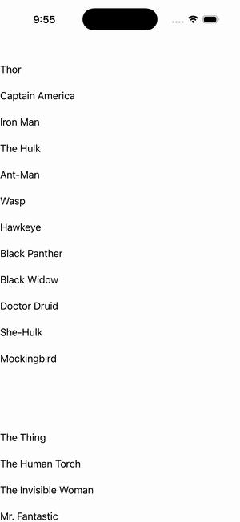

# CollectionView — Grouping + Selection

Ports .NET MAUI's `GroupingPlusSelection` ([oracle](../../../../../src/Controls/samples/Controls.Sample/Pages/Controls/CollectionViewGalleries/GroupingGalleries/GroupingPlusSelection.xaml)) as a code-first `maui::samples::grouping_plus_selection_page`. A single CollectionView with IsGrouped=True **and** SelectionMode=Single together over the SuperTeams source, with header/footer/member templates; single selection observable via `select_member(group,member)`/`selected_member()`.

| macOS (AppKit) | iOS (UIKit) |
| --- | --- |
|  |  |

**Running on iOS:**

**Platforms:** macOS ✅ demo · iOS ✅ demo · Windows ⬜ TODO · Linux ⬜ TODO · Android ⬜ TODO

**Run it:** `MAUI_SAMPLE_PAGE=grouping_plus_selection ./build/apple/maui_macos_gallery` (macOS) · `SIMCTL_CHILD_MAUI_SAMPLE_PAGE=grouping_plus_selection xcrun simctl launch booted dev.maui-cpp.ios-gallery` (iOS)
