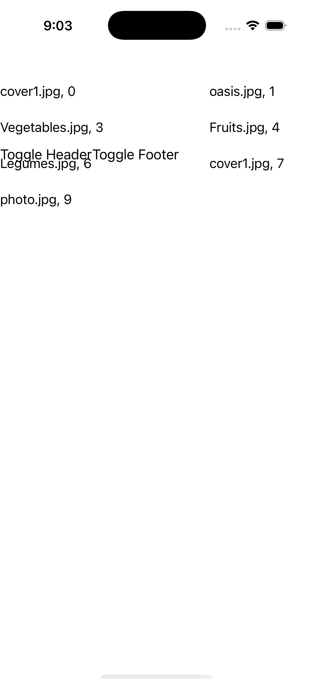
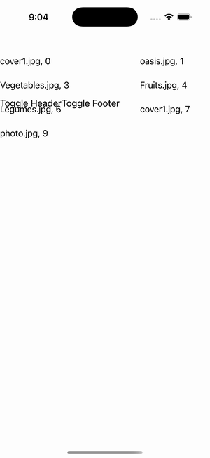

# CollectionView — Header/Footer View (grid)

Ports .NET MAUI's `HeaderFooterGrid` ([oracle](../../../../../src/Controls/samples/Controls.Sample/Pages/Controls/CollectionViewGalleries/HeaderFooterGalleries/HeaderFooterGrid.xaml)) as a code-first `maui::samples::header_footer_grid_page`. A **View** Header + **View** Footer (a stack: image + bold caption + 'Add Content' button) over a GridItemsLayout(Span 3); Toggle Header / Toggle Footer (stash-and-flip to null and back) + Add Content (appends a label to the chrome stack).

| macOS (AppKit) | iOS (UIKit) |
| --- | --- |
|  |  |

**Running on iOS:**

**Platforms:** macOS ✅ demo · iOS ✅ demo · Windows ⬜ TODO · Linux ⬜ TODO · Android ⬜ TODO

**Run it:** `MAUI_SAMPLE_PAGE=header_footer_grid ./build/apple/maui_macos_gallery` (macOS) · `SIMCTL_CHILD_MAUI_SAMPLE_PAGE=header_footer_grid xcrun simctl launch booted dev.maui-cpp.ios-gallery` (iOS)

> Struct-typed item cells render their template-bound content natively (post the TemplatedCell.Bind fix).
