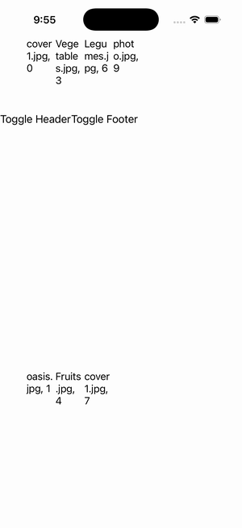

# CollectionView — Header/Footer (horizontal grid)

Ports .NET MAUI's `HeaderFooterGridHorizontal` ([oracle](../../../../../src/Controls/samples/Controls.Sample/Pages/Controls/CollectionViewGalleries/HeaderFooterGalleries/HeaderFooterGridHorizontal.xaml)) as a code-first `maui::samples::header_footer_grid_horizontal_page`. A View Header + View Footer over a **horizontal** GridItemsLayout (Span 3) — the lone structural difference from HeaderFooterGrid being `items_layout_orientation::horizontal` — with Toggle Header/Footer + Add Content.

| macOS (AppKit) | iOS (UIKit) |
| --- | --- |
|  |  |

**Running on iOS:**

**Platforms:** macOS ✅ demo · iOS ✅ demo · Windows ⬜ TODO · Linux ⬜ TODO · Android ⬜ TODO

**Run it:** `MAUI_SAMPLE_PAGE=header_footer_grid_horizontal ./build/apple/maui_macos_gallery` (macOS) · `SIMCTL_CHILD_MAUI_SAMPLE_PAGE=header_footer_grid_horizontal xcrun simctl launch booted dev.maui-cpp.ios-gallery` (iOS)
