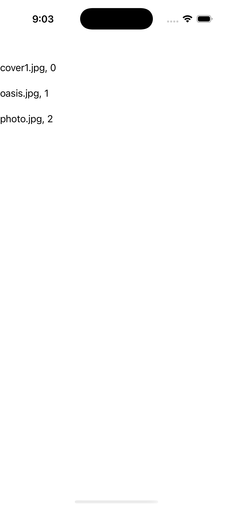

# CollectionView — Header/Footer Template

Ports .NET MAUI's `HeaderFooterTemplate` ([oracle](../../../../../src/Controls/samples/Controls.Sample/Pages/Controls/CollectionViewGalleries/HeaderFooterGalleries/HeaderFooterTemplate.xaml)) as a code-first `maui::samples::header_footer_template_page`. HeaderTemplate/FooterTemplate as **data_template views** (a centered bold Label bound to the model's CurrentTime, Header/Footer value = the model itself), plus a live TapCommand that re-stamps the time and re-realizes the chrome.

| macOS (AppKit) | iOS (UIKit) |
| --- | --- |
|  |  |

**Running on iOS:**

**Platforms:** macOS ✅ demo · iOS ✅ demo · Windows ⬜ TODO · Linux ⬜ TODO · Android ⬜ TODO

**Run it:** `MAUI_SAMPLE_PAGE=header_footer_template ./examples/build/gallery/gallery` (macOS) · `SIMCTL_CHILD_MAUI_SAMPLE_PAGE=header_footer_template xcrun simctl launch booted dev.maui-cpp.ios-gallery` (iOS)

> Struct-typed item cells render their template-bound content natively (post the TemplatedCell.Bind fix).
