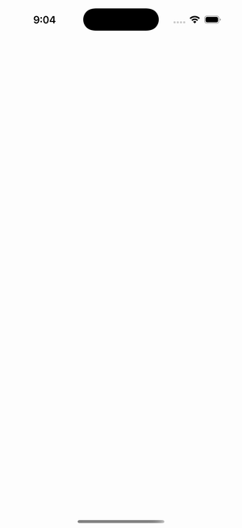

# CollectionView — Header/Footer View

Ports .NET MAUI's `HeaderFooterView` ([oracle](../../../../../src/Controls/samples/Controls.Sample/Pages/Controls/CollectionViewGalleries/HeaderFooterGalleries/HeaderFooterView.xaml)) as a code-first `maui::samples::header_footer_view_page`. A View Header (grid: image + label) and a 2×2-grid View Footer (image + rotated label + two command Buttons); AddCommand appends rows, ClearCommand empties — the footer buttons drive the (initially empty) source.

| macOS (AppKit) | iOS (UIKit) |
| --- | --- |
|  |  |

**Running on iOS:**

**Platforms:** macOS ✅ demo · iOS ✅ demo · Windows ⬜ TODO · Linux ⬜ TODO · Android ⬜ TODO

**Run it:** `MAUI_SAMPLE_PAGE=header_footer_view ./build/apple/maui_macos_gallery` (macOS) · `SIMCTL_CHILD_MAUI_SAMPLE_PAGE=header_footer_view xcrun simctl launch booted dev.maui-cpp.ios-gallery` (iOS)

> Struct-typed item cells render their template-bound content natively (post the TemplatedCell.Bind fix).
