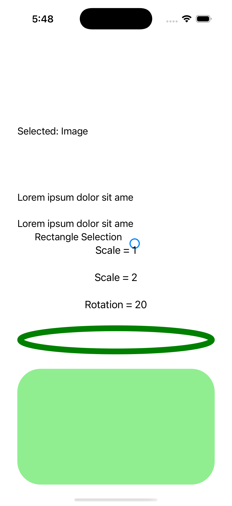

# Hit Testing

Ports .NET MAUI's `HitTestingPage` ([oracle](../../../../../src/Controls/samples/Controls.Sample/Pages/HitTestingPage.xaml)) as a code-first `maui::samples::hit_testing_page`. Which overlapping view receives a tap — single and rectangle selection.

| macOS (AppKit) | iOS (UIKit) |
| --- | --- |
|  |  |

**Running on iOS:**

**Platforms:** macOS ✅ demo · iOS ✅ demo · Windows ⬜ TODO · Linux ⬜ TODO · Android ⬜ TODO

**Run it:** `MAUI_SAMPLE_PAGE=hit_testing ./examples/build/gallery/gallery` (macOS) · `SIMCTL_CHILD_MAUI_SAMPLE_PAGE=hit_testing xcrun simctl launch booted dev.maui-cpp.ios-gallery` (iOS)

> A scrolled view set (aligned labels, Scale=1/Scale=2/Rotation=20 buttons, ellipse, rounded box_view, image) with a deterministic bounds-based `hit_test(point)` reporting which overlapping view receives the synthetic tap (named on a SelectionLabel + highlighted red), plus a checkbox-driven single-vs-rectangle selection mode with a lasso intersection walk. The native `GetVisualTreeElements` walk + `WindowOverlay.Tapped` drive + IDrawable lasso rendering are the documented headless gap (`window_overlay.hpp`), so selection is modeled over assigned representative frames — exactly as input_transparent models InputTransparent routing.
