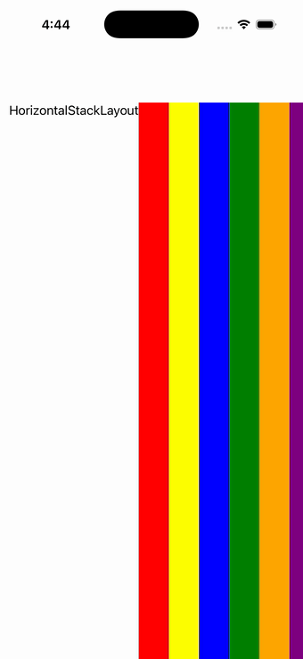

# HorizontalStackLayout

Ports .NET MAUI's `HorizontalStackLayoutPage` ([oracle](../../../../../src/Controls/samples/Controls.Sample/Pages/Layouts/HorizontalStackLayoutPage.xaml)) as a code-first `maui::samples::horizontal_stack_page`. A `horizontal_stack_layout` stacking a label + six colored BoxViews left-to-right with padding.

| macOS (AppKit) | iOS (UIKit) |
| --- | --- |
|  |  |

**Running on iOS:**

**Platforms:** macOS ✅ demo · iOS ✅ demo · Windows ⬜ TODO · Linux ⬜ TODO · Android ⬜ TODO

**Run it:**
- macOS — `MAUI_SAMPLE_PAGE=horizontal_stack ./examples/build/gallery/gallery`
- iOS sim — `SIMCTL_CHILD_MAUI_SAMPLE_PAGE=horizontal_stack xcrun simctl launch booted dev.maui-cpp.ios-gallery`

> On macOS the gallery host sizes the window to the measured content over plain (unflipped) NSViews, so
> layout pages can show a partial/single block — the iOS capture is the faithful top-down layout. 
