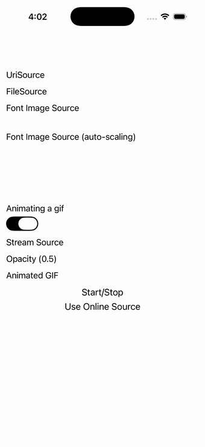

# Image

Ports .NET MAUI's `ImagePage` ([oracle](../../../../../src/Controls/samples/Controls.Sample/Pages/Controls/ImagePage.xaml)) as a code-first `maui::samples::image_page`. URI / file / font (auto-scaling on+off) / stream image sources, a switch driving an animated GIF's IsAnimationPlaying, Opacity, and Start/Stop animation controls.

| macOS (AppKit) | iOS (UIKit) |
| --- | --- |
|  |  |

**Running on iOS:**

**Platforms:** macOS ✅ demo · iOS ✅ demo · Windows ⬜ TODO · Linux ⬜ TODO · Android ⬜ TODO

**Run it:**
- macOS — `MAUI_SAMPLE_PAGE=image ./examples/build/gallery/gallery`
- iOS sim — `SIMCTL_CHILD_MAUI_SAMPLE_PAGE=image xcrun simctl launch booted dev.maui-cpp.ios-gallery`

> Notes: png/gif assets need bundling to display (file sources point at plausible bundle-relative paths; the stream source is wired but returns no bytes headless) — the control wiring is faithful.
