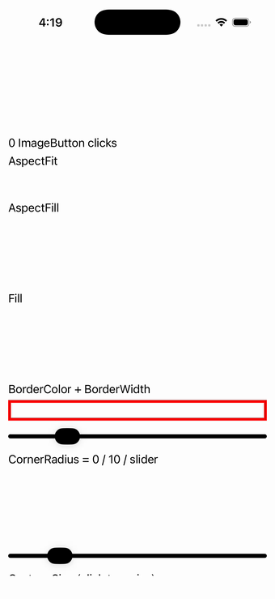

# ImageButton

Ports .NET MAUI's `ImageButtonPage` ([oracle](../../../../../src/Controls/samples/Controls.Sample/Pages/Controls/ImageButtonPage.xaml)) as a code-first `maui::samples::image_button_page`. ImageButton Aspect (Fit/Fill) with a shared click-count readout, BorderColor + slider-driven BorderWidth, fixed + slider-driven CornerRadius, click-to-resize, slider-driven Padding, an animated-GIF source with a "Use Online Source" URI swap, and a solid-background Update/Remove toggle.

| macOS (AppKit) | iOS (UIKit) |
| --- | --- |
|  |  |

**Running on iOS:**

**Platforms:** macOS ✅ demo · iOS ✅ demo · Windows ⬜ TODO · Linux ⬜ TODO · Android ⬜ TODO

**Run it:**
- macOS — `MAUI_SAMPLE_PAGE=image_button ./build/apple/maui_macos_gallery`
- iOS sim — `SIMCTL_CHILD_MAUI_SAMPLE_PAGE=image_button xcrun simctl launch booted dev.maui-cpp.ios-gallery`

> Notes: cog.png/dotnet_bot.png/gif are bundled assets the headless backend can't rasterize (the source is minted faithfully); the C# random gradient collapses to a deterministic green/purple toggle.
