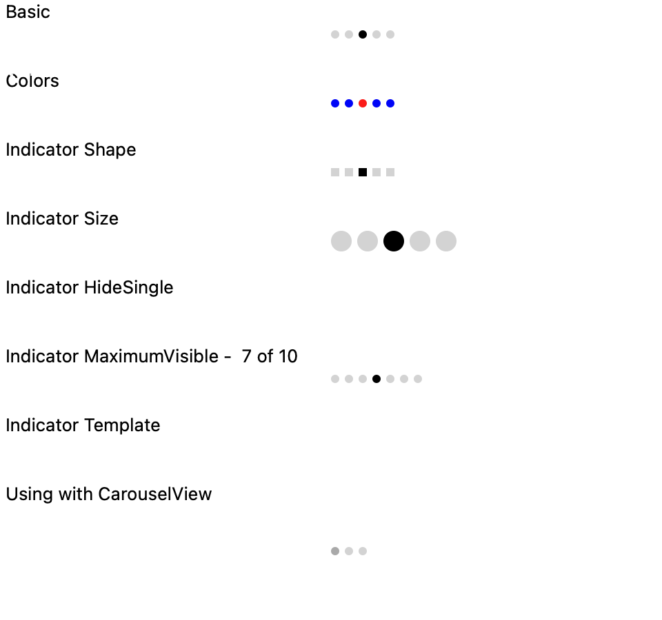
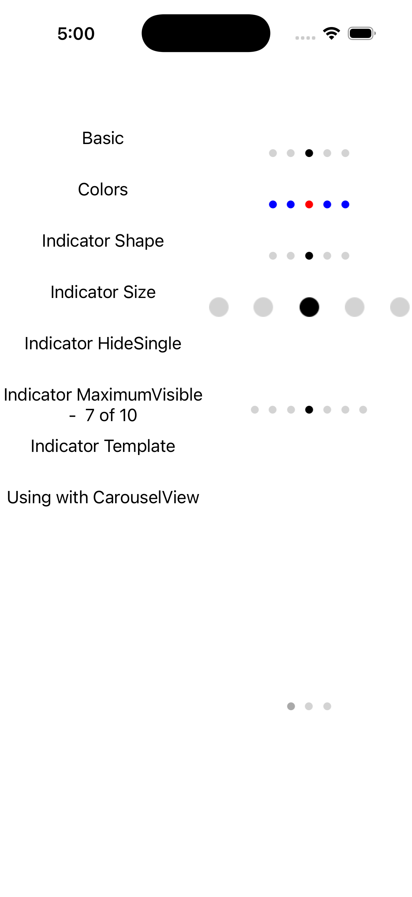
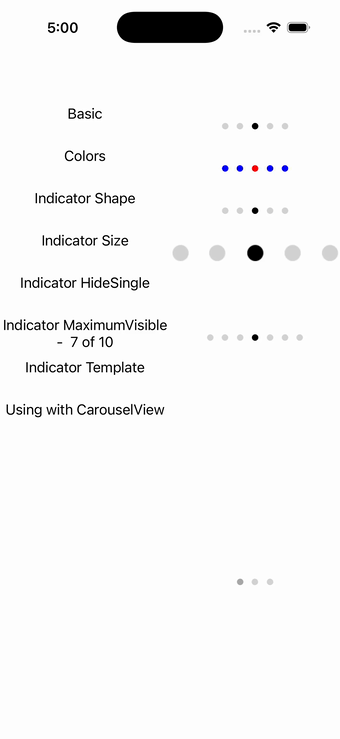

# Indicator (IndicatorView)

Ports .NET MAUI's `IndicatorPage` ([oracle](../../../../../src/Controls/samples/Controls.Sample/Pages/Controls/IndicatorPage.xaml)) as a code-first `maui::samples::indicator_page`. A 2-col grid covering the IndicatorView contract: Count/Position, selected/unselected/background colors, Square IndicatorsShape, IndicatorSize, HideSingle, MaximumVisible, and a CarouselView wired to an IndicatorView.

| macOS (AppKit) | iOS (UIKit) |
| --- | --- |
|  |  |

**Running on iOS:**

**Platforms:** macOS ✅ demo · iOS ✅ demo · Windows ⬜ TODO · Linux ⬜ TODO · Android ⬜ TODO

**Run it:** `MAUI_SAMPLE_PAGE=indicator ./examples/build/gallery/gallery` (macOS) · `SIMCTL_CHILD_MAUI_SAMPLE_PAGE=indicator xcrun simctl launch booted dev.maui-cpp.ios-gallery` (iOS)

> Notes: the custom IndicatorTemplate path is deferred (default dots); the CarouselView↔IndicatorView link is reproduced explicitly.
