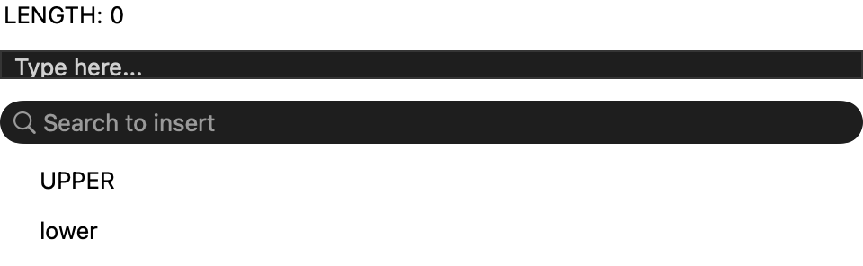
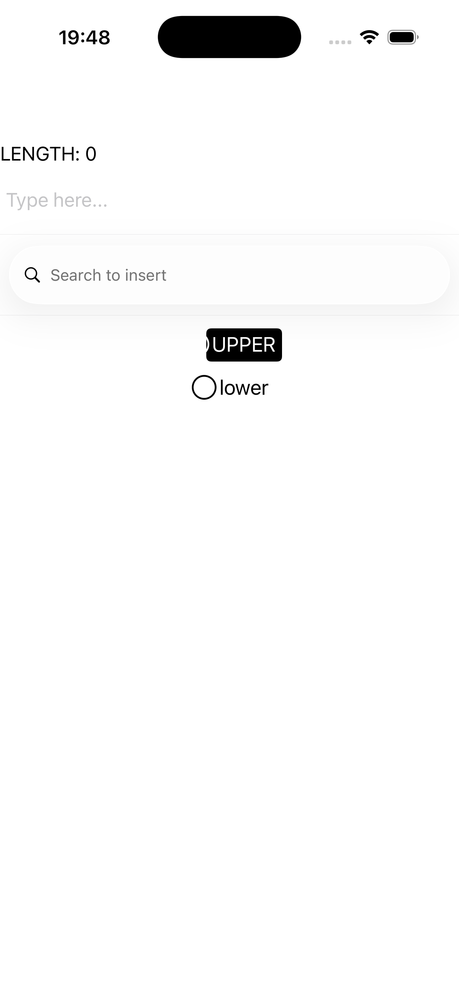

# Input controls

Text-entry controls: a multi-line `editor`, a `search_bar`, a grouped pair of `radio_button`s, and an
`image_button` — wired so each input drives a readout. Source:
[`input_controls_page.hpp`](../../../examples/gallery/pages/input_controls_page.hpp).

| macOS (AppKit) | iOS (UIKit) |
| --- | --- |
|  |  |

**Running on iOS:**

**Native controls exercised:** `NSTextView`/`UITextView` (editor), `NSSearchField`/`UISearchBar`,
drawn radio buttons with attached grouping, image button, length-readout label.

**Platforms:** macOS ✅ demo · iOS ✅ demo · Windows ⬜ TODO · Linux ⬜ TODO · Android ⬜ TODO

**Run it:**
- macOS — `MAUI_SAMPLE_PAGE=input_controls ./examples/build/gallery/gallery`
- iOS sim — `SIMCTL_CHILD_MAUI_SAMPLE_PAGE=input_controls xcrun simctl launch booted dev.maui-cpp.ios-gallery`

> The search bar and radio-button group render natively; the editor + image button are present in the
> stack but visually subtle at the default sizing.
