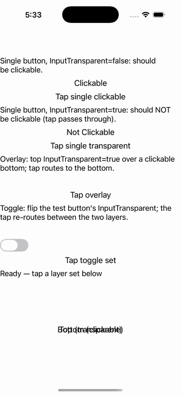

# InputTransparent

Ports .NET MAUI's `InputTransparentPage` ([oracle](../../../../../src/Controls/samples/Controls.Sample/Pages/Core/InputTransparentPage.xaml)) as a code-first `maui::samples::input_transparent_page`. VisualElement.InputTransparent input routing, demonstrated with a hit-test walk.

| macOS (AppKit) | iOS (UIKit) |
| --- | --- |
|  |  |

**Running on iOS:**

**Platforms:** macOS ✅ demo · iOS ✅ demo · Windows ⬜ TODO · Linux ⬜ TODO · Android ⬜ TODO

**Run it:** `MAUI_SAMPLE_PAGE=input_transparent ./examples/build/gallery/gallery` (macOS) · `SIMCTL_CHILD_MAUI_SAMPLE_PAGE=input_transparent xcrun simctl launch booted dev.maui-cpp.ios-gallery` (iOS)

> A static hit_test/simulate_tap walks each top→bottom button stack and delivers the tap (`send_clicked`) to the first view whose `input_transparent()` is false: a clickable button (Success), a transparent button (pass-through → Failure), a transparent-over-clickable overlay (routes to bottom), and a toggle_switch that flips the test button's InputTransparent live and re-runs the tap to show re-routing; the readout mirrors C#'s ClickSuccess/ClickFail. `CascadeInputTransparent` is not in the headless view surface (left as a `// note:` — per-view InputTransparent is demonstrated, not invented); the readout replaces the C# DisplayAlert.
