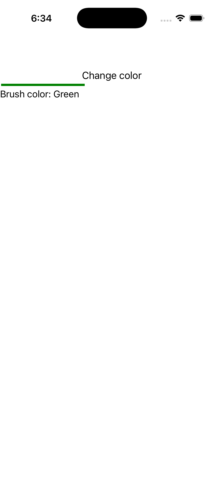

# Invalidate Brush

Ports .NET MAUI's `InvalidateBrushGallery` ([oracle](../../../../../src/Controls/samples/Controls.Sample/Pages/Controls/ShapesGalleries/InvalidateBrushGallery.xaml)) as a code-first `maui::samples::invalidate_brush_page`. One shared solid brush painting both a Line's stroke and a Button's background, with a 'Change color' button cycling Green→Red→Blue (a fresh `solid_paint` per cycle re-applied to both consumers) + a status readout.

| macOS (AppKit) | iOS (UIKit) |
| --- | --- |
|  |  |

**Running on iOS:**

**Platforms:** macOS ✅ demo · iOS ✅ demo · Windows ⬜ TODO · Linux ⬜ TODO · Android ⬜ TODO

**Run it:** `MAUI_SAMPLE_PAGE=invalidate_brush ./examples/build/gallery/gallery` (macOS) · `SIMCTL_CHILD_MAUI_SAMPLE_PAGE=invalidate_brush xcrun simctl launch booted dev.maui-cpp.ios-gallery` (iOS)

> Natively-rendered shape demo — the Shape family draws through the graphics_view / shape_view handler over a CoreGraphics canvas.
