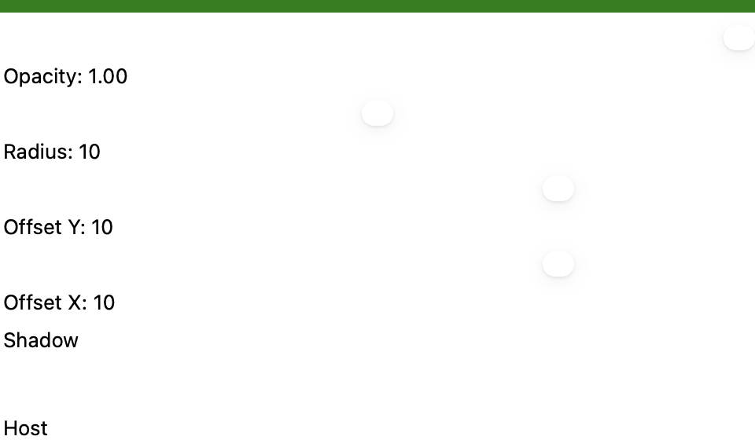
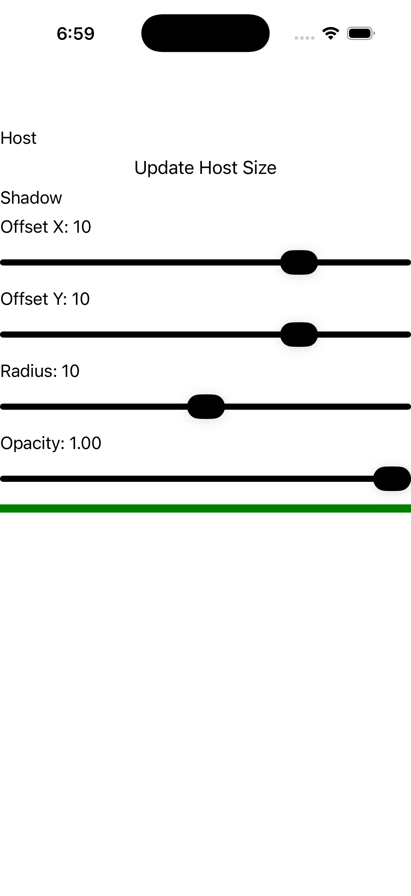
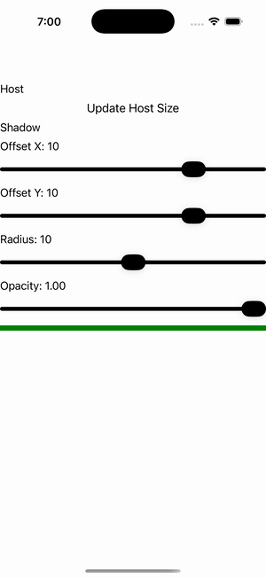

# Invalidate Shadow Host

Ports .NET MAUI's `InvalidateShadowHostPage` ([oracle](../../../../../src/Controls/samples/Controls.Sample/Pages/Core/ShadowGalleries/InvalidateShadowHostPage.xaml)) as a code-first `maui::samples::invalidate_shadow_host_page`. A green-stroked white Border host with a red Shadow + an 'Update Host Size' button that resizes the host and re-applies the shadow to prove invalidation, plus offset/radius/opacity sliders driving the shadow scalars (deterministic 50px size stepping for a reproducible headless run).

| macOS (AppKit) | iOS (UIKit) |
| --- | --- |
|  |  |

**Running on iOS:**

**Platforms:** macOS ✅ demo · iOS ✅ demo · Windows ⬜ TODO · Linux ⬜ TODO · Android ⬜ TODO

**Run it:** `MAUI_SAMPLE_PAGE=invalidate_shadow_host ./build/apple/maui_macos_gallery` (macOS) · `SIMCTL_CHILD_MAUI_SAMPLE_PAGE=invalidate_shadow_host xcrun simctl launch booted dev.maui-cpp.ios-gallery` (iOS)
