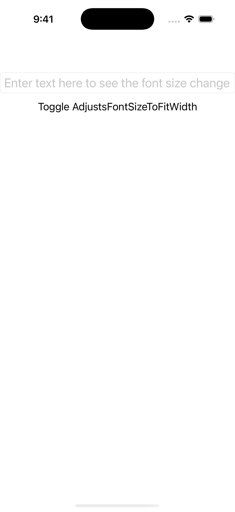
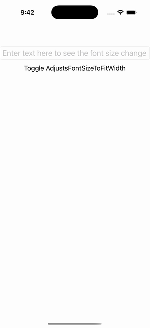

# iOS Specific — Entry

Ports .NET MAUI's `iOSEntryPage` ([oracle](../../../../../src/Controls/samples/Controls.Sample/Pages/PlatformSpecifics/iOS/iOSEntryPage.xaml)) as a code-first `maui::samples::ios_entry_page`. An Entry with iOSSpecific `AdjustsFontSizeToFitWidth`=true and `CursorColor`=LimeGreen, plus a button toggling AdjustsFontSizeToFitWidth. CursorColor is wired-real on iOS (`UITextField.tintColor`).

| macOS (AppKit) | iOS (UIKit) |
| --- | --- |
|  |  |

**Running on iOS:**

**Platforms:** macOS ✅ demo · iOS ✅ demo · Windows ⬜ TODO · Linux ⬜ TODO · Android ⬜ TODO

**Run it:** `MAUI_SAMPLE_PAGE=ios_entry ./examples/build/gallery/gallery` (macOS) · `SIMCTL_CHILD_MAUI_SAMPLE_PAGE=ios_entry xcrun simctl launch booted dev.maui-cpp.ios-gallery` (iOS)

> Exercises the **iOSSpecific platform-configuration** surface via `element.on<ios>()` + the `ios_specific::*` knob free-functions (the C# `.On<iOS>().SetXxx()` form). The control renders on both backends; the knob is wired-real on iOS where noted and stored-inert (round-tripping) on headless/AppKit.
