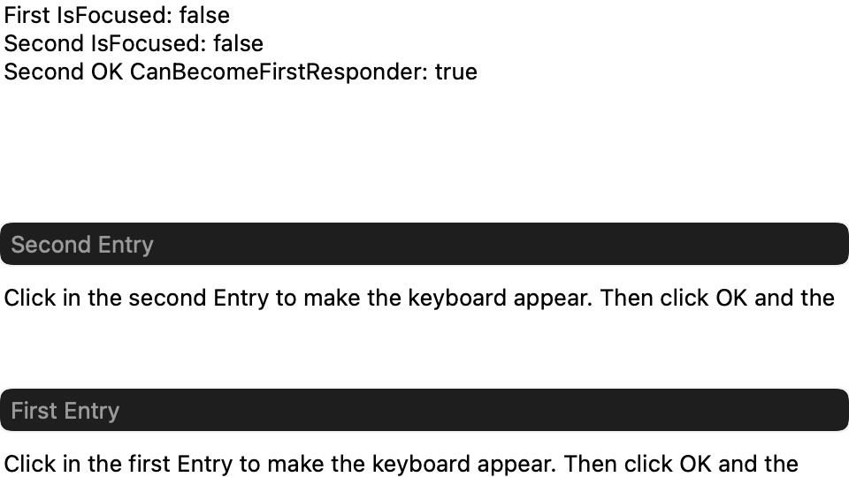
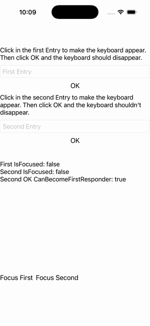

# iOS Specific — First Responder

Ports .NET MAUI's `iOSFirstResponderPage` ([oracle](../../../../../src/Controls/samples/Controls.Sample/Pages/PlatformSpecifics/iOS/iOSFirstResponderPage.xaml)) as a code-first `maui::samples::ios_first_responder_page`. The focus subsystem (per-entry Focus/Unfocus + IsFocused readout, the headless stand-in for keyboard show/hide) AND the iOSSpecific `VisualElement.CanBecomeFirstResponder` attached property set + read-back via `button.on<ios>()`.

| macOS (AppKit) | iOS (UIKit) |
| --- | --- |
|  |  |

**Running on iOS:**

**Platforms:** macOS ✅ demo · iOS ✅ demo · Windows ⬜ TODO · Linux ⬜ TODO · Android ⬜ TODO

**Run it:** `MAUI_SAMPLE_PAGE=ios_first_responder ./build/apple/maui_macos_gallery` (macOS) · `SIMCTL_CHILD_MAUI_SAMPLE_PAGE=ios_first_responder xcrun simctl launch booted dev.maui-cpp.ios-gallery` (iOS)
