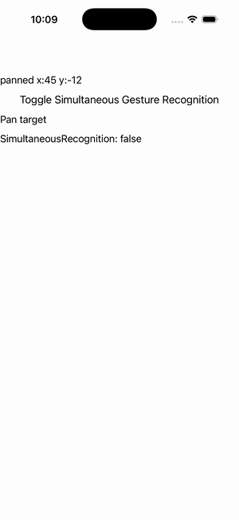

# iOS Specific — Pan Gesture Recognizer

Ports .NET MAUI's `iOSPanGestureRecognizerPage` ([oracle](../../../../../src/Controls/samples/Controls.Sample/Pages/PlatformSpecifics/iOS/iOSPanGestureRecognizerPage.xaml)) as a code-first `maui::samples::ios_pan_gesture_page`. A PanGestureRecognizer reporting 'panned x:.. y:..' (synthetically driven Started→Running→Completed) + a Toggle button flipping the iOSSpecific `Application.PanGestureRecognizerShouldRecognizeSimultaneously` knob via `application.on<ios>()`.

| macOS (AppKit) | iOS (UIKit) |
| --- | --- |
|  |  |

**Running on iOS:**

**Platforms:** macOS ✅ demo · iOS ✅ demo · Windows ⬜ TODO · Linux ⬜ TODO · Android ⬜ TODO

**Run it:** `MAUI_SAMPLE_PAGE=ios_pan_gesture ./build/apple/maui_macos_gallery` (macOS) · `SIMCTL_CHILD_MAUI_SAMPLE_PAGE=ios_pan_gesture xcrun simctl launch booted dev.maui-cpp.ios-gallery` (iOS)
