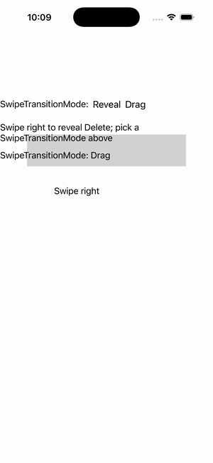

# iOS Specific — SwipeView Transition Mode

Ports .NET MAUI's `iOSSwipeViewTransitionModePage` ([oracle](../../../../../src/Controls/samples/Controls.Sample/Pages/PlatformSpecifics/iOS/iOSSwipeViewTransitionModePage.xaml)) as a code-first `maui::samples::ios_swipe_transition_page`. The iOSSpecific `SwipeView.SwipeTransitionMode` knob (Reveal/Drag) on a swipe_view (init Drag) driven by Reveal/Drag buttons, plus a LeftItems Delete item whose Invoked drives a readout; synthetically opened for the capture. (`On<iOS>().SetSwipeTransitionMode` maps onto the cross-platform SwipeTransitionMode bindable.)

| macOS (AppKit) | iOS (UIKit) |
| --- | --- |
|  |  |

**Running on iOS:**

**Platforms:** macOS ✅ demo · iOS ✅ demo · Windows ⬜ TODO · Linux ⬜ TODO · Android ⬜ TODO

**Run it:** `MAUI_SAMPLE_PAGE=ios_swipe_transition ./examples/build/gallery/gallery` (macOS) · `SIMCTL_CHILD_MAUI_SAMPLE_PAGE=ios_swipe_transition xcrun simctl launch booted dev.maui-cpp.ios-gallery` (iOS)
