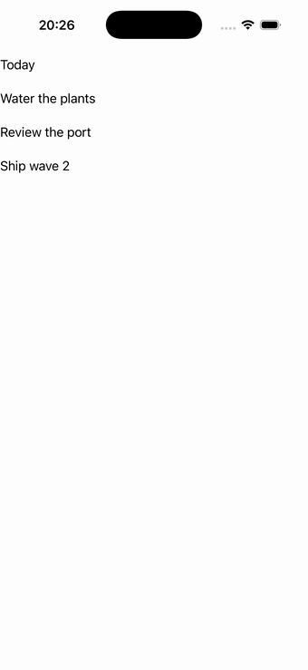

# Items (CollectionView)

A `collection_view` over a live observable items source with a templated cell, single selection
driving a readout, and an empty-view for the cleared state. Source:
[`items_page.hpp`](../../../src/samples/pages/items_page.hpp).

| macOS (AppKit) | iOS (UIKit) |
| --- | --- |
|  |  |

**Running on iOS:**

**Native controls exercised:** `NSCollectionView` (AppKit) / `UICollectionView` compositional layout
(iOS Items2) with recycled templated cells; selection-driven readout label.

**Platforms:** macOS ✅ demo · iOS ✅ demo · Windows ⬜ TODO · Linux ⬜ TODO · Android ⬜ TODO

**Run it:**
- macOS — `MAUI_SAMPLE_PAGE=items ./build/apple/maui_macos_gallery`
- iOS sim — `SIMCTL_CHILD_MAUI_SAMPLE_PAGE=items xcrun simctl launch booted dev.maui-cpp.ios-gallery`

> The iOS capture shows the realized item rows ("Water the plants", "Review the port", "Ship wave 2")
> under the header readout.
