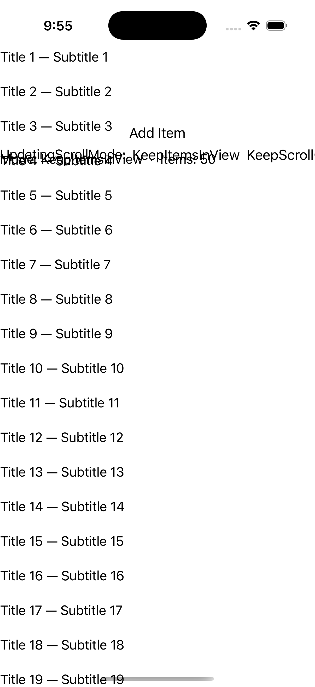
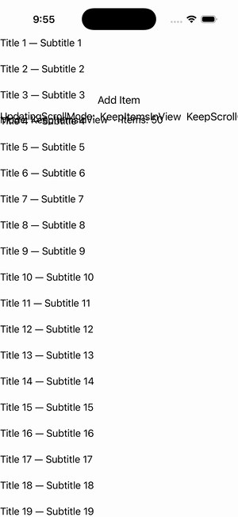

# CollectionView — ItemsUpdatingScrollMode

Ports .NET MAUI's `ItemsUpdatingScrollModeGallery` ([oracle](../../../../../src/Controls/samples/Controls.Sample/Pages/Controls/CollectionViewGalleries/ItemsUpdatingScrollModeGallery.xaml)) as a code-first `maui::samples::items_updating_scroll_mode_page`. ItemsUpdatingScrollMode (KeepItemsInView / KeepScrollOffset / KeepLastItemInView buttons) over a live collection + an Add Item button + a mode/count readout — controls where the viewport lands when items are inserted.

| macOS (AppKit) | iOS (UIKit) |
| --- | --- |
|  |  |

**Running on iOS:**

**Platforms:** macOS ✅ demo · iOS ✅ demo · Windows ⬜ TODO · Linux ⬜ TODO · Android ⬜ TODO

**Run it:** `MAUI_SAMPLE_PAGE=items_updating_scroll_mode ./build/apple/maui_macos_gallery` (macOS) · `SIMCTL_CHILD_MAUI_SAMPLE_PAGE=items_updating_scroll_mode xcrun simctl launch booted dev.maui-cpp.ios-gallery` (iOS)
