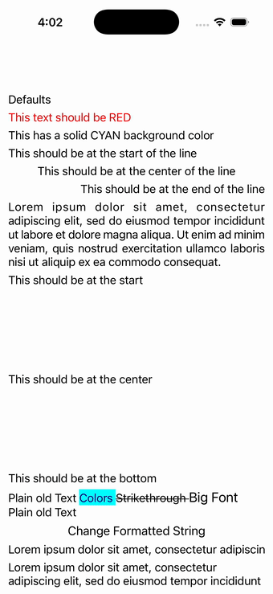

# Label

Ports .NET MAUI's `LabelPage` ([oracle](../../../../../src/Controls/samples/Controls.Sample/Pages/Controls/LabelPage.xaml)) as a code-first `maui::samples::label_page`. Defaults, TextColor, solid background, the full horizontal (start/center/end/justify) + vertical (start/center/end) alignment matrix, multi-span FormattedText with a runtime "Change Formatted String" button, MaxLines, and all six LineBreakMode values.

| macOS (AppKit) | iOS (UIKit) |
| --- | --- |
|  |  |

**Running on iOS:**

**Platforms:** macOS ✅ demo · iOS ✅ demo · Windows ⬜ TODO · Linux ⬜ TODO · Android ⬜ TODO

**Run it:**
- macOS — `MAUI_SAMPLE_PAGE=label ./examples/build/gallery/gallery`
- iOS sim — `SIMCTL_CHILD_MAUI_SAMPLE_PAGE=label xcrun simctl launch booted dev.maui-cpp.ios-gallery`

> Notes: HTML-text labels, per-span tap gestures and the EllipseGeometry clip demo are simplified/omitted.
