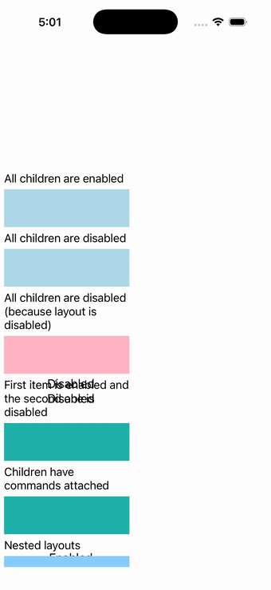

# Layout IsEnabled

Ports .NET MAUI's `LayoutIsEnabledPage` ([oracle](../../../../../src/Controls/samples/Controls.Sample/Pages/Layouts/LayoutIsEnabledPage.xaml)) as a code-first `maui::samples::layout_is_enabled_page`. IsEnabled cascading from a layout to its children: six state sub-stacks (enabled/disabled/disabled-via-layout/mixed/command-bound/nested) + Disable/Enable buttons, and a right layout whose IsEnabled is driven by checkboxes.

| macOS (AppKit) | iOS (UIKit) |
| --- | --- |
|  |  |

**Running on iOS:**

**Platforms:** macOS ✅ demo · iOS ✅ demo · Windows ⬜ TODO · Linux ⬜ TODO · Android ⬜ TODO

**Run it:** `MAUI_SAMPLE_PAGE=layout_is_enabled ./build/apple/maui_macos_gallery` (macOS) · `SIMCTL_CHILD_MAUI_SAMPLE_PAGE=layout_is_enabled xcrun simctl launch booted dev.maui-cpp.ios-gallery` (iOS)

> Notes: two-way bindings modelled via checked_changed→set_is_enabled; the ICommand CanExecute→IsEnabled coupling is reduced to a guard flag.
