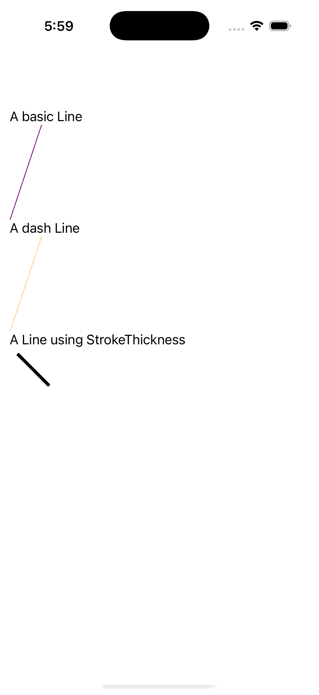
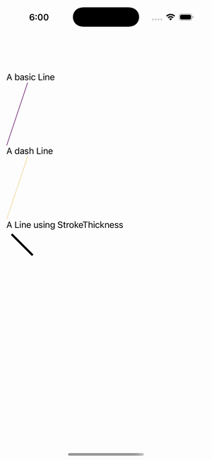

# Line Gallery

Ports .NET MAUI's `LineGallery` ([oracle](../../../../../src/Controls/samples/Controls.Sample/Pages/Controls/ShapesGalleries/LineGallery.xaml)) as a code-first `maui::samples::line_gallery_page`. Three lines (basic / dashed / thick) in a bare stack.

| macOS (AppKit) | iOS (UIKit) |
| --- | --- |
|  |  |

**Running on iOS:**

**Platforms:** macOS ✅ demo · iOS ✅ demo · Windows ⬜ TODO · Linux ⬜ TODO · Android ⬜ TODO

**Run it:** `MAUI_SAMPLE_PAGE=line_gallery ./build/apple/maui_macos_gallery` (macOS) · `SIMCTL_CHILD_MAUI_SAMPLE_PAGE=line_gallery xcrun simctl launch booted dev.maui-cpp.ios-gallery` (iOS)

> These are **natively-rendered** shape demos — the Shape control family (`controls::shapes::*`) draws through the graphics_view / shape_view handler over a CoreGraphics canvas, so the geometry is real pixels on both Apple backends (not a readout). A purple basic line (40,0)→(0,120), an orange dashed(1,1 / offset 6) line, and a black thickness-4 line. No ScrollView (the page hosts the stack directly, matching the XAML).
