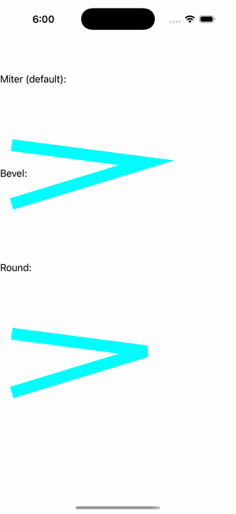

# Line Join Gallery

Ports .NET MAUI's `LineJoinGallery` ([oracle](../../../../../src/Controls/samples/Controls.Sample/Pages/Controls/ShapesGalleries/LineJoinGallery.xaml)) as a code-first `maui::samples::line_join_gallery_page`. The three StrokeLineJoin variants on an identical thick polyline.

| macOS (AppKit) | iOS (UIKit) |
| --- | --- |
|  |  |

**Running on iOS:**

**Platforms:** macOS ✅ demo · iOS ✅ demo · Windows ⬜ TODO · Linux ⬜ TODO · Android ⬜ TODO

**Run it:** `MAUI_SAMPLE_PAGE=line_join_gallery ./examples/build/gallery/gallery` (macOS) · `SIMCTL_CHILD_MAUI_SAMPLE_PAGE=line_join_gallery xcrun simctl launch booted dev.maui-cpp.ios-gallery` (iOS)

> These are **natively-rendered** shape demos — the Shape control family (`controls::shapes::*`) draws through the graphics_view / shape_view handler over a CoreGraphics canvas, so the geometry is real pixels on both Apple backends (not a readout). Miter (default) / Bevel / Round on a 20px-thick Aqua open polyline "20 20,250 50,20 120", each wrapped in its own single-cell Grid and captioned. The StaticResource `PolylineStyle` is applied as code-first setters.
