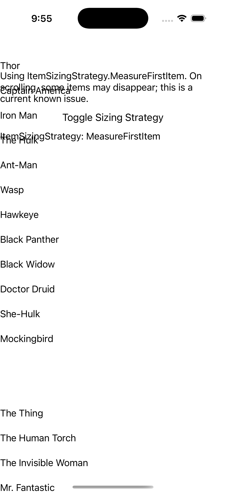
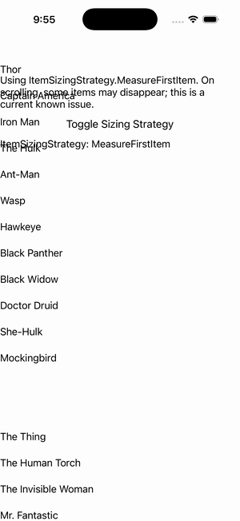

# CollectionView — MeasureFirstItem Strategy

Ports .NET MAUI's `MeasureFirstStrategy` ([oracle](../../../../../src/Controls/samples/Controls.Sample/Pages/Controls/CollectionViewGalleries/GroupingGalleries/MeasureFirstStrategy.xaml)) as a code-first `maui::samples::measure_first_strategy_page`. ItemSizingStrategy=MeasureFirstItem on a grouped CollectionView (SuperTeams) with header/footer templates + a MeasureFirstItem↔MeasureAllItems toggle + a strategy readout.

| macOS (AppKit) | iOS (UIKit) |
| --- | --- |
|  |  |

**Running on iOS:**

**Platforms:** macOS ✅ demo · iOS ✅ demo · Windows ⬜ TODO · Linux ⬜ TODO · Android ⬜ TODO

**Run it:** `MAUI_SAMPLE_PAGE=measure_first_strategy ./examples/build/gallery/gallery` (macOS) · `SIMCTL_CHILD_MAUI_SAMPLE_PAGE=measure_first_strategy xcrun simctl launch booted dev.maui-cpp.ios-gallery` (iOS)
