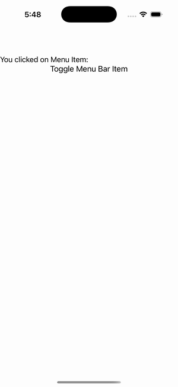

# Menu Bar

Ports .NET MAUI's `MenuBarPage` ([oracle](../../../../../src/Controls/samples/Controls.Sample/Pages/Core/MenuBarPage.xaml)) as a code-first `maui::samples::menu_bar_page`. Page-level MenuBarItems with sub-menus, routed through ItemClicked.

| macOS (AppKit) | iOS (UIKit) |
| --- | --- |
|  |  |

**Running on iOS:**

**Platforms:** macOS ✅ demo · iOS ✅ demo · Windows ⬜ TODO · Linux ⬜ TODO · Android ⬜ TODO

**Run it:** `MAUI_SAMPLE_PAGE=menu_bar ./examples/build/gallery/gallery` (macOS) · `SIMCTL_CHILD_MAUI_SAMPLE_PAGE=menu_bar xcrun simctl launch booted dev.maui-cpp.ios-gallery` (iOS)

> Three MenuBarItems (Before File with action/separator/disabled item, File with an icon item, Custom Menu with Item 1 + a Sub Menu 1 holding flyout items + a disabled Item 2), each clickable item writing 'You clicked on Menu Item: <text>' into a visible label; plus the page body (the label + a Toggle button adding/removing an 'Added Menu'). The menu bar needs window chrome the gallery doesn't mount, so items are exercised programmatically and the body renders the on-screen content. IconImageSource + KeyboardAccelerators are set but render no pixels / dispatch no keys headless.
