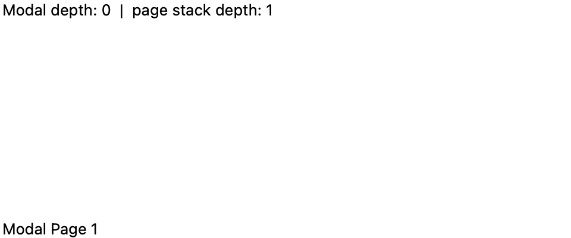
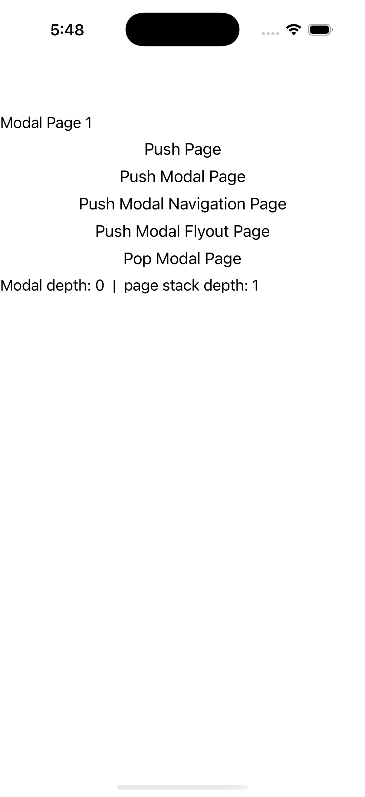
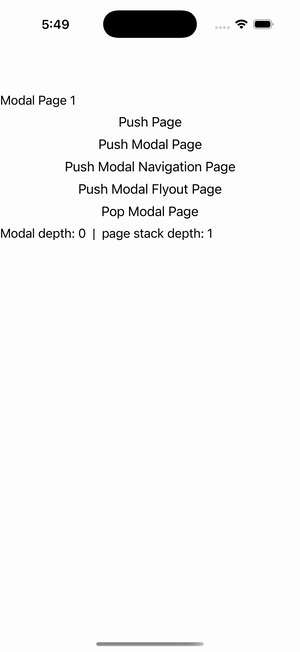

# Modal Navigation

Ports .NET MAUI's `ModalPage` ([oracle](../../../../../src/Controls/samples/Controls.Sample/Pages/Core/ModalPage.xaml)) as a code-first `maui::samples::modal_page`. PushModal/PopModal on a separate modal stack.

| macOS (AppKit) | iOS (UIKit) |
| --- | --- |
|  |  |

**Running on iOS:**

**Platforms:** macOS ✅ demo · iOS ✅ demo · Windows ⬜ TODO · Linux ⬜ TODO · Android ⬜ TODO

**Run it:** `MAUI_SAMPLE_PAGE=modal ./examples/build/gallery/gallery` (macOS) · `SIMCTL_CHILD_MAUI_SAMPLE_PAGE=modal xcrun simctl launch booted dev.maui-cpp.ios-gallery` (iOS)

> PushModal/PopModal on the page-owned `navigation_page`'s separate `modal_stack` (plus Push on the page stack); the readout shows modal depth + page-stack depth + top-modal title; 'Pop Modal Page' is enabled only while the modal stack is non-empty (the C# `PopModal.IsVisible = ModalStack.Count>0`). NavigationPage-root and FlyoutPage modal wrappers are flattened to content_page stand-ins (same modal-depth effect); BackgroundColor + OnAppearing/OnNavigating bookkeeping omitted (no headless surface).
