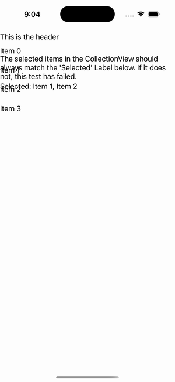

# CollectionView — Multiple Bound Selection

Ports .NET MAUI's `MultipleBoundSelection` ([oracle](../../../../../src/Controls/samples/Controls.Sample/Pages/Controls/CollectionViewGalleries/SelectionGalleries/MultipleBoundSelection.xaml)) as a code-first `maui::samples::multiple_bound_selection_page`. SelectionMode=Multiple with a bound SelectedItems collection + a comma-joined readout, exercising all three C# mutation paths — ClearAndAdd (mutate the VM collection), Reset (replace it), DirectUpdate (mutate the view's own selection).

| macOS (AppKit) | iOS (UIKit) |
| --- | --- |
|  |  |

**Running on iOS:**

**Platforms:** macOS ✅ demo · iOS ✅ demo · Windows ⬜ TODO · Linux ⬜ TODO · Android ⬜ TODO

**Run it:** `MAUI_SAMPLE_PAGE=multiple_bound_selection ./examples/build/gallery/gallery` (macOS) · `SIMCTL_CHILD_MAUI_SAMPLE_PAGE=multiple_bound_selection xcrun simctl launch booted dev.maui-cpp.ios-gallery` (iOS)

> Struct-typed item cells render their template-bound content natively (post the TemplatedCell.Bind fix).
