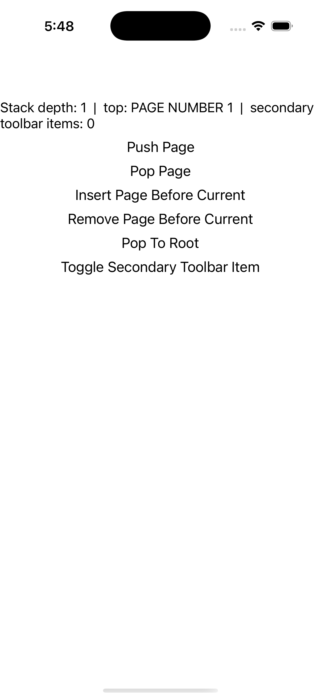
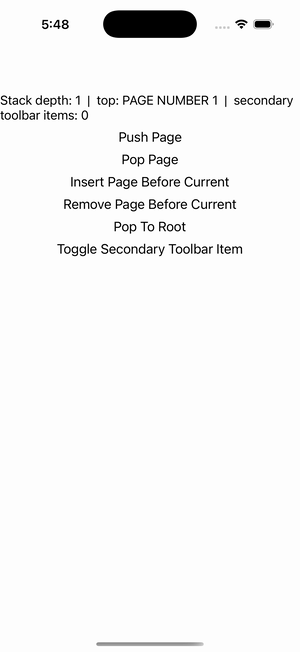

# Navigation Gallery

Ports .NET MAUI's `NavigationGalleryPage` ([oracle](../../../../../src/Controls/samples/Controls.Sample/Pages/Core/NavigationGallery.xaml)) as a code-first `maui::samples::navigation_gallery_page`. NavigationPage push/pop/insert/remove on a page-owned stack.

| macOS (AppKit) | iOS (UIKit) |
| --- | --- |
|  |  |

**Running on iOS:**

**Platforms:** macOS ✅ demo · iOS ✅ demo · Windows ⬜ TODO · Linux ⬜ TODO · Android ⬜ TODO

**Run it:** `MAUI_SAMPLE_PAGE=navigation_gallery ./examples/build/gallery/gallery` (macOS) · `SIMCTL_CHILD_MAUI_SAMPLE_PAGE=navigation_gallery xcrun simctl launch booted dev.maui-cpp.ios-gallery` (iOS)

> push / pop / insert-before / remove-before-current / pop-to-root on a page-owned `navigation_page` (5-page pool) + the ToggleSecondaryToolbarItem add/remove on the current page; the readout shows live stack depth + top-page title + secondary-toolbar-item count. The gallery hosts one content_page, so navigation runs on a page-owned navigation_page (readout-observed, not a live visual push); SwapRoot/ToggleNavigationBar/ToggleBackButton need a live stack-nav host (noted).
