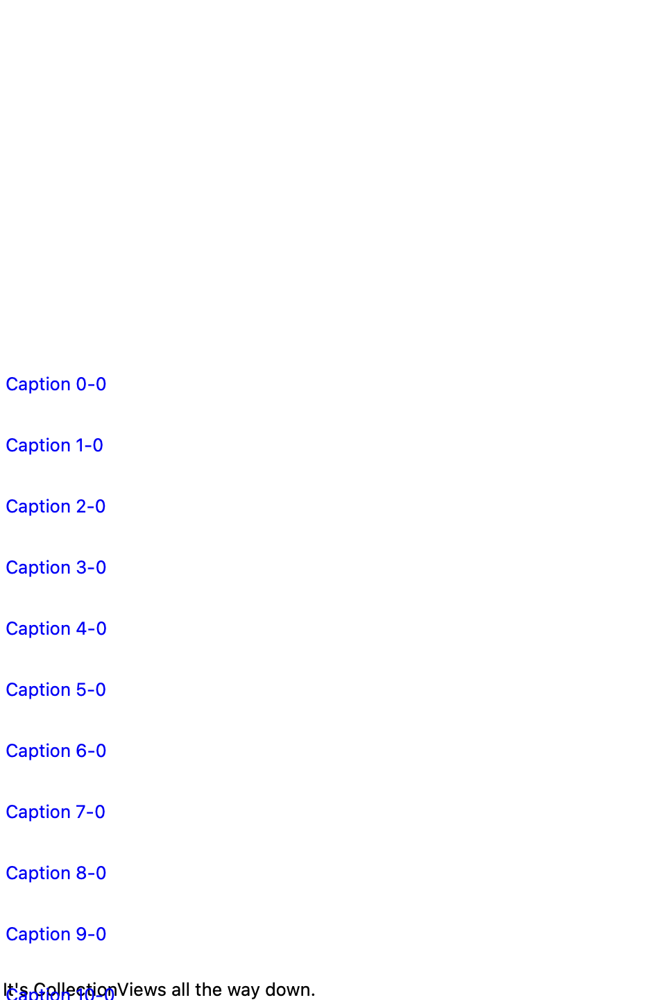
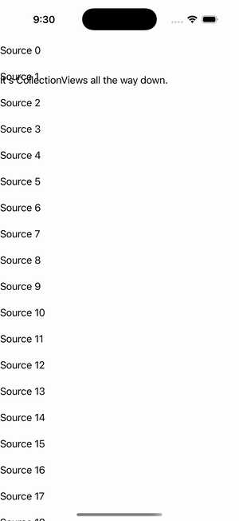

# CollectionView — Nested

Ports .NET MAUI's `NestedCollectionViewGallery` ([oracle](../../../../../src/Controls/samples/Controls.Sample/Pages/Controls/CollectionViewGalleries/NestedGalleries/NestedCollectionViewGallery.xaml)) as a code-first `maui::samples::nested_collection_page`. An outer CollectionView whose item template **is an inner collection_view** (`data_template::of<collection_view>()`) — confirming a data_template can host a collection_view child — with the inner ItemsSource bound off each outer item. 'It's CollectionViews all the way down.'

| macOS (AppKit) | iOS (UIKit) |
| --- | --- |
|  |  |

**Running on iOS:**

**Platforms:** macOS ✅ demo · iOS ✅ demo · Windows ⬜ TODO · Linux ⬜ TODO · Android ⬜ TODO

**Run it:** `MAUI_SAMPLE_PAGE=nested_collection ./examples/build/gallery/gallery` (macOS) · `SIMCTL_CHILD_MAUI_SAMPLE_PAGE=nested_collection xcrun simctl launch booted dev.maui-cpp.ios-gallery` (iOS)

> Struct-typed item cells render their template-bound content natively (post the TemplatedCell.Bind fix).
