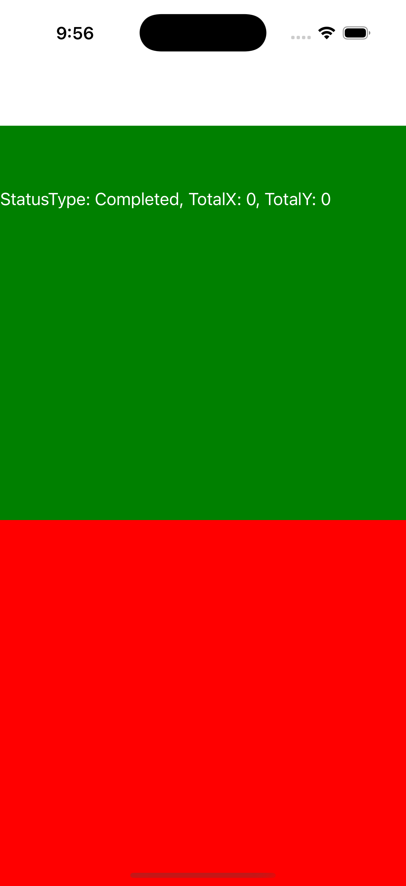
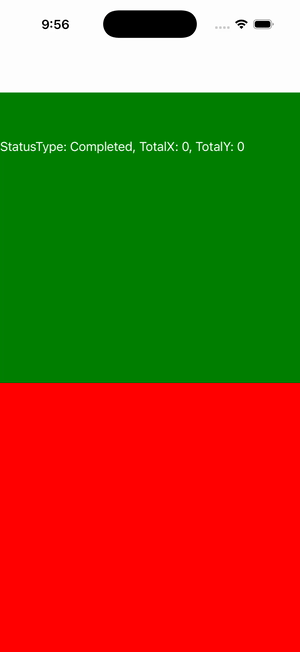

# Pan Gesture Events

Ports .NET MAUI's `PanGestureEventsGallery` ([oracle](../../../../../src/Controls/samples/Controls.Sample/Pages/Core/PanGestureGalleries/PanGestureEventsGallery.xaml)) as a code-first `maui::samples::pan_gesture_events_page`. A PanGestureRecognizer on a green target reporting 'StatusType, TotalX, TotalY' into a readout across the Started→Running→Completed state machine; headless has no native input, so attach_handlers synthetically drives one pan through the `i_pan_gesture_controller` seam.

| macOS (AppKit) | iOS (UIKit) |
| --- | --- |
|  |  |

**Running on iOS:**

**Platforms:** macOS ✅ demo · iOS ✅ demo · Windows ⬜ TODO · Linux ⬜ TODO · Android ⬜ TODO

**Run it:** `MAUI_SAMPLE_PAGE=pan_gesture_events ./examples/build/gallery/gallery` (macOS) · `SIMCTL_CHILD_MAUI_SAMPLE_PAGE=pan_gesture_events xcrun simctl launch booted dev.maui-cpp.ios-gallery` (iOS)
