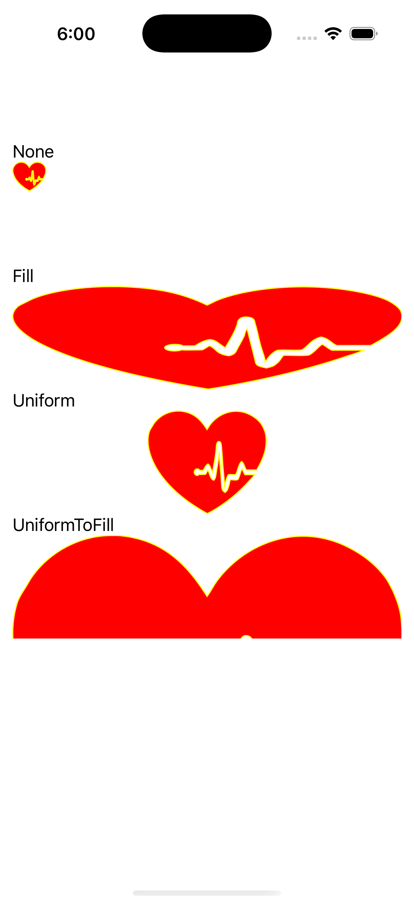
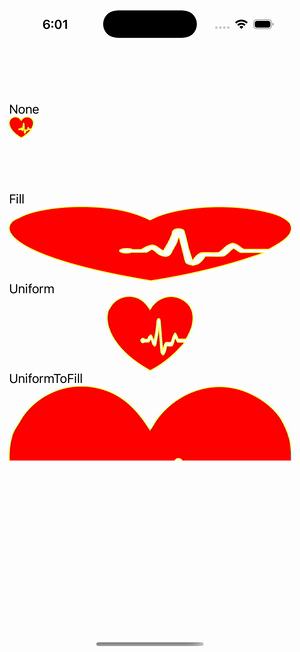

# Path Aspect Gallery

Ports .NET MAUI's `PathAspectGallery` ([oracle](../../../../../src/Controls/samples/Controls.Sample/Pages/Controls/ShapesGalleries/PathAspectGallery.xaml)) as a code-first `maui::samples::path_aspect_gallery_page`. The four Path Aspect (Stretch) modes on one shared geometry.

| macOS (AppKit) | iOS (UIKit) |
| --- | --- |
|  |  |

**Running on iOS:**

**Platforms:** macOS ✅ demo · iOS ✅ demo · Windows ⬜ TODO · Linux ⬜ TODO · Android ⬜ TODO

**Run it:** `MAUI_SAMPLE_PAGE=path_aspect_gallery ./build/apple/maui_macos_gallery` (macOS) · `SIMCTL_CHILD_MAUI_SAMPLE_PAGE=path_aspect_gallery xcrun simctl launch booted dev.maui-cpp.ios-gallery` (iOS)

> These are **natively-rendered** shape demos — the Shape control family (`controls::shapes::*`) draws through the graphics_view / shape_view handler over a CoreGraphics canvas, so the geometry is real pixels on both Apple backends (not a readout). None / Fill / Uniform / UniformToFill on one bird-silhouette geometry, each 100×100 with LightGray bg / Yellow stroke / Red fill (mapping to none / stretch / aspect_fit / aspect_fill per shape.hpp's documented Stretch collapse). Geometry parsed once per Path via `parse_path_figure_collection`.
