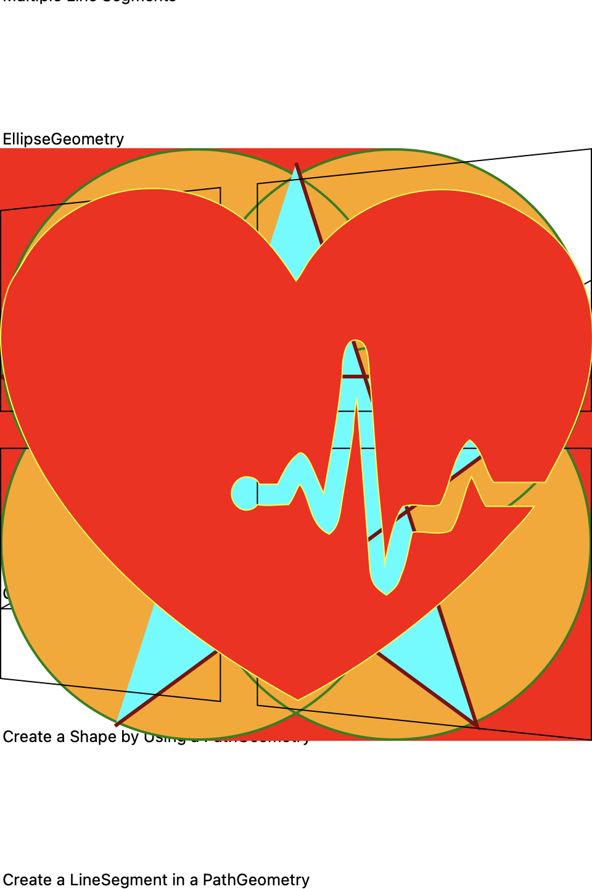
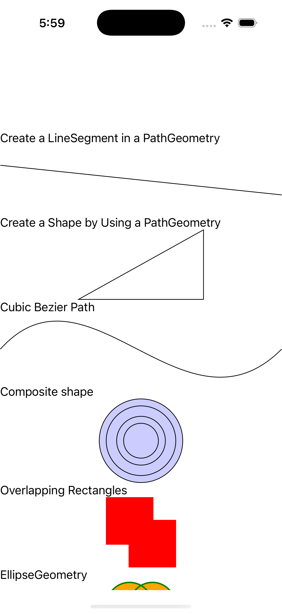
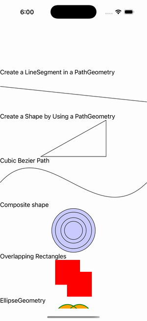

# Path Gallery

Ports .NET MAUI's `PathGallery` ([oracle](../../../../../src/Controls/samples/Controls.Sample/Pages/Controls/ShapesGalleries/PathGallery.xaml)) as a code-first `maui::samples::path_gallery_page`. Eight Path variants — markup-parsed and programmatic geometry.

| macOS (AppKit) | iOS (UIKit) |
| --- | --- |
|  |  |

**Running on iOS:**

**Platforms:** macOS ✅ demo · iOS ✅ demo · Windows ⬜ TODO · Linux ⬜ TODO · Android ⬜ TODO

**Run it:** `MAUI_SAMPLE_PAGE=path_gallery ./examples/build/gallery/gallery` (macOS) · `SIMCTL_CHILD_MAUI_SAMPLE_PAGE=path_gallery xcrun simctl launch booted dev.maui-cpp.ios-gallery` (iOS)

> These are **natively-rendered** shape demos — the Shape control family (`controls::shapes::*`) draws through the graphics_view / shape_view handler over a CoreGraphics canvas, so the geometry is real pixels on both Apple backends (not a readout). Markup-parsed line "M 10,50 L 200,70", a programmatic closed PathGeometry triangle, a markup cubic Bezier, an EvenOdd GeometryGroup of four concentric ellipses (alternating filled/hollow rings, #CCCCFF), an overlapping-rectangles group, a 2×2 EllipseGeometry group, an open multi-LineSegment star, and two complex glyph markup paths — each beside its markup-string caption. Markup Data via `parse_path_geometry`; object-element geometries built programmatically (the XAML wave is deferred).
