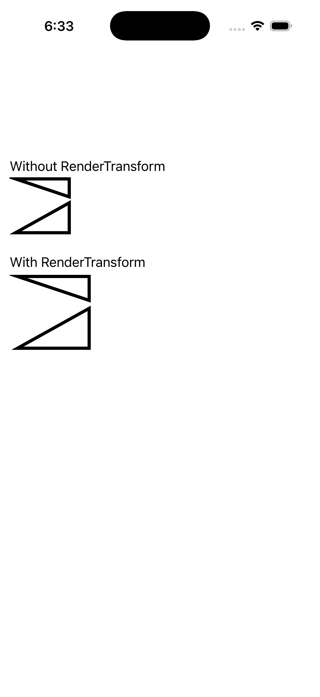

# Path Transform (matrix string)

Ports .NET MAUI's `PathTransformStringGallery` ([oracle](../../../../../src/Controls/samples/Controls.Sample/Pages/Controls/ShapesGalleries/PathTransformStringGallery.xaml)) as a code-first `maui::samples::path_transform_string_page`. The same two-triangle PathGeometry rendered twice to contrast a `matrix_transform` (RenderTransform string "0.75 0 0 0.75 0 0" → a uniform origin scale) against an identical untransformed Path.

| macOS (AppKit) | iOS (UIKit) |
| --- | --- |
|  |  |

**Running on iOS:**

**Platforms:** macOS ✅ demo · iOS ✅ demo · Windows ⬜ TODO · Linux ⬜ TODO · Android ⬜ TODO

**Run it:** `MAUI_SAMPLE_PAGE=path_transform_string ./build/apple/maui_macos_gallery` (macOS) · `SIMCTL_CHILD_MAUI_SAMPLE_PAGE=path_transform_string xcrun simctl launch booted dev.maui-cpp.ios-gallery` (iOS)

> Natively-rendered shape demo — the Shape family draws through the graphics_view / shape_view handler over a CoreGraphics canvas.
