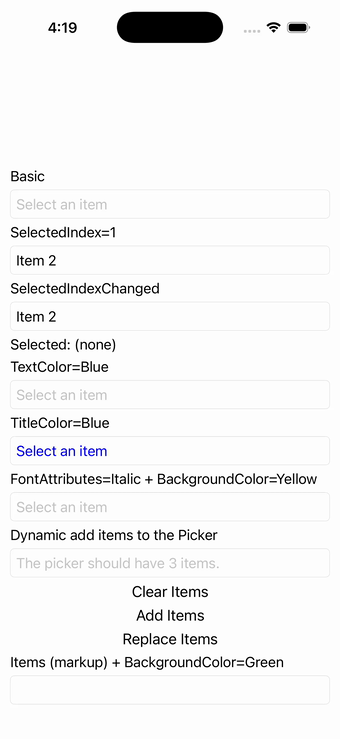

# Picker

Ports .NET MAUI's `PickerPage` ([oracle](../../../../../src/Controls/samples/Controls.Sample/Pages/Controls/PickerPage.xaml)) as a code-first `maui::samples::picker_page`. Picker variants: a basic 20-item ItemsSource, SelectedIndex=1 with SelectedIndexChanged driving a readout, TextColor/TitleColor/italic-font+yellow-background styling, dynamic Add/Clear/Replace item buttons, and a markup-items picker.

| macOS (AppKit) | iOS (UIKit) |
| --- | --- |
|  |  |

**Running on iOS:**

**Platforms:** macOS ✅ demo · iOS ✅ demo · Windows ⬜ TODO · Linux ⬜ TODO · Android ⬜ TODO

**Run it:**
- macOS — `MAUI_SAMPLE_PAGE=picker ./build/apple/maui_macos_gallery`
- iOS sim — `SIMCTL_CHILD_MAUI_SAMPLE_PAGE=picker xcrun simctl launch booted dev.maui-cpp.ios-gallery`

> Notes: Picker.ItemDisplayBinding is string-only in the port, so the BindingContext block collapses to a plain Items picker; the IsOpen Open/Close + gradient-background buttons are dialog-bound and omitted.
